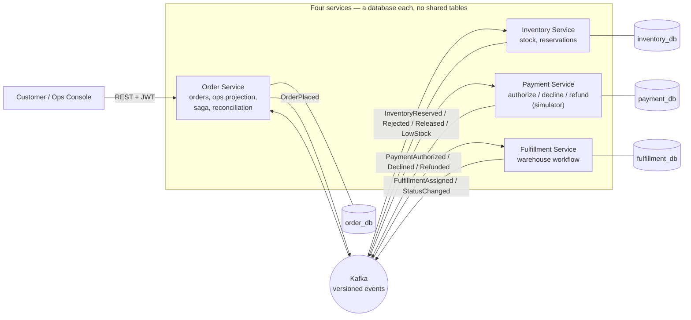

# FulfillOps

**Event-driven order fulfillment and reliability platform.**

> **Status — Phase 13 (documentation & evidence).** Phases 0–12 are complete: four
> independently deployable Spring Boot (Java 21) services coordinate through versioned Kafka
> events with a transactional outbox and idempotent inbox; a React/TypeScript operations
> console; Prometheus metrics, OpenTelemetry tracing, Grafana dashboards, alert rules, failure
> scenarios, and k6 load tests; and CI/CD with quality gates plus Kubernetes and (optional,
> never-applied) AWS Terraform packaging. Every capability described below is running code with
> tests; anything not yet built is labeled **(planned)**. What was actually run versus written
> is tracked honestly in [`docs/PHASE_STATUS.md`](docs/PHASE_STATUS.md), and boundaries are in
> [`docs/KNOWN_LIMITATIONS.md`](docs/KNOWN_LIMITATIONS.md).

## What it is

FulfillOps is a portfolio-grade simulation of how a real e-commerce fulfillment backend stays
correct under failure. It follows an order from placement through inventory reservation, payment
authorization, and warehouse dispatch — as four services that coordinate through Kafka events
instead of shared databases or synchronous call chains. When a step fails partway through, it
**compensates**: releases reserved stock, refunds the simulated payment, and gives an operator a
queue of exceptions to resolve, instead of silently losing or duplicating the order.

It demonstrates two things with working code and tests, not just diagrams:

1. **Java backend engineering** — service boundaries, transactional outboxes, idempotent
   consumers, concurrency-safe inventory updates, and recoverable failure handling.
2. **Operations systems thinking** — an operator console and analytics surface for a team that
   has to keep a fulfillment pipeline running.

## Architecture



Full event mapping: [`docs/EVENT_CATALOG.md`](docs/EVENT_CATALOG.md). Design and reasoning:
[`docs/ARCHITECTURE.md`](docs/ARCHITECTURE.md) and the [ADR index](docs/adr/README.md).

### Service ownership

| Service | Owns | Public API (roles) | Port |
| --- | --- | --- | --- |
| **Order** | Order lifecycle, idempotent placement, cancellation saga, reconciliation, operations projection/KPIs/incidents | `POST /api/v1/orders` (CUSTOMER), `/api/v1/ops/**` (OPERATOR/ADMIN), dead-letter admin | 8081 |
| **Inventory** | Stock levels, concurrency-safe reservation/release, adjustments | `/api/v1/inventory/**`, `/api/v1/products` (ADMIN + OPERATOR reads) | 8082 |
| **Payment** | Deterministic authorize/decline/refund simulator | `/api/v1/payments/**` (OPERATOR/ADMIN) | 8083 |
| **Fulfillment** | Warehouse workflow state machine, operator actions | `/api/v1/fulfillments/**` (OPERATOR/ADMIN) | 8084 |
| **Ops Console** | React/TypeScript operator UI (six routes) | Browser, PKCE login | 5173 |

## How it flows

**Happy path.** Customer places an order (idempotency key) → Order persists `PENDING` + an
`OrderPlaced.v1` outbox event in one transaction → Inventory reserves stock and emits
`InventoryReserved.v1` → Payment authorizes and emits `PaymentAuthorized.v1` → Fulfillment
creates a fulfillment and emits `FulfillmentAssigned.v1` → an operator advances it through
`PICKING → PACKED → DISPATCHED → DELIVERED`. Order consumes every service's events to keep the
customer view and the operations projection current.

**Compensation.** Any failure triggers compensation by choreography — no orchestrator: an
inventory rejection finalizes straight to `CANCELLED`; a declined payment releases the
reservation; a cancellation before dispatch releases stock, refunds the payment, and cancels the
fulfillment, finalizing only once every required compensation is confirmed. What cannot be safely
auto-resolved becomes a `REQUIRES_REVIEW` order plus an operations incident with an
acknowledge/assign/resolve lifecycle. The full state machine and rules are in
[`docs/DOMAIN_MODEL.md`](docs/DOMAIN_MODEL.md).

## Reliability guarantees — and their exact boundaries

- **At-least-once delivery, made correct by idempotent consumers.** Kafka redelivers; each
  consumer de-duplicates on an inbox keyed by `(event_id, consumer_name)`, and database
  constraints (unique `order_id` per reservation/payment/fulfillment) are the backstop. **This
  is not exactly-once, and the project never claims it is** ([ADR 0004](docs/adr/0004-at-least-once-delivery.md)).
- **Atomic publish.** An event is written to a transactional outbox in the same transaction as
  the state change, then relayed to Kafka — no lost or phantom events ([ADR 0003](docs/adr/0003-outbox-inbox.md)).
- **No oversell.** Reservations use `SELECT ... FOR UPDATE` plus optimistic locking; an
  integration test races 10 orders for 5 units and asserts exactly 5 win, stock never negative.
- **Bounded retry, then dead-letter.** Every consumer has retry topics and a `-dlt`; a
  non-retryable business rejection skips retries. Dead letters are replayable only by an audited
  ADMIN endpoint, by id — never an arbitrary payload.
- **Stuck work is found, not lost.** A reconciliation job (guarded by a Postgres advisory lock so
  only one instance acts per pass) nudges or escalates stuck orders.

## Security

Native Spring Security OAuth2 **Resource Server** on every service, validating a Keycloak JWT by
issuer **and** a required `fulfillops-api` audience; `realm_access.roles` → `ROLE_*`. Three roles
(`CUSTOMER`/`OPERATOR`/`ADMIN`) enforced by both URL rules and service-layer ownership checks.
RFC 9457 Problem Details for every error (no stack traces or secrets leaked). The console uses
Authorization Code + PKCE and keeps tokens in memory, never `localStorage`. **No card number,
bank detail, or SSN is ever accepted, logged, or stored** — the payment service is a deterministic
simulator. Full model and threat summary: [`docs/SECURITY.md`](docs/SECURITY.md).

## Operations and KPIs

Order Service owns a rebuildable operations projection behind `/api/v1/ops/**` (OPERATOR/ADMIN):
KPI overview / time-series / stage-duration reads, an SLA-breach-aware backlog and stuck-orders
view, a searchable/filterable/CSV-exportable work queue, per-order event timelines, and the
incident lifecycle. **Every KPI has an exact documented formula — never a fabricated number** —
in [`docs/KPI_DICTIONARY.md`](docs/KPI_DICTIONARY.md).

## Screenshots

Real captures from the console's demo mode ([`docs/screenshots/`](docs/screenshots/)):

| | | |
| --- | --- | --- |
| [Login](docs/screenshots/01-login.png) | [Overview](docs/screenshots/02-overview.png) | [Work Queue](docs/screenshots/03-work-queue.png) |
| [Order Detail](docs/screenshots/04-order-detail.png) | [Incidents](docs/screenshots/05-incidents.png) | [Inventory Risk](docs/screenshots/06-inventory-risk.png) |
| [Fulfillment Board](docs/screenshots/07-fulfillment-board.png) | | |

Grafana, distributed-trace, and failure-recovery screenshots are not committed — they need the
full observability stack running; capture instructions are in
[`docs/demo/FAILURE_DEMO.md`](docs/demo/FAILURE_DEMO.md). See
[`docs/KNOWN_LIMITATIONS.md`](docs/KNOWN_LIMITATIONS.md).

## Quick start

Requires **JDK 21** (Maven is bundled via `./mvnw`) and **Docker**.

```
cp .env.example .env
make infra-up               # PostgreSQL, Kafka, Redis, Keycloak — waits until healthy
make run-order              # each service in its own terminal (or: make demo-up, all in containers)
make smoke                  # start all four services, exercise JWT auth, then stop them
./mvnw -B verify            # format check, build, unit + Testcontainers integration tests + coverage gate
```

Deterministic end-to-end demo (seeds one order of every shape through the real APIs — no manual
DB edits): `scripts/seed-demo-data.sh`, then open the console. Walkthrough:
[`docs/demo/DEMO_SCRIPT.md`](docs/demo/DEMO_SCRIPT.md).

**Console:** `cd apps/ops-console && npm install && npm run dev` → http://localhost:5173.

**Demo users** (fictional, local-only, from `infra/keycloak/realm-export.json`): `customer.demo`,
`operator.demo`, `admin.demo`. `operator.demo`'s password is `OperatorDemo!123` — as fictional as
every other credential here.

## API examples

```bash
# Place an order (CUSTOMER). Totals are computed server-side from the line items.
curl -sf -X POST http://localhost:8081/api/v1/orders \
  -H "Authorization: Bearer $TOKEN" \
  -H "Idempotency-Key: 6f1e...-unique-per-request" \
  -H "Content-Type: application/json" \
  -d '{ "items": [ { "sku": "DEMO-SKU-1", "quantity": 2, "unitPrice": { "amount": "19.99", "currency": "USD" } } ] }'

# Track it (owner, or any OPERATOR/ADMIN)
curl -sf http://localhost:8081/api/v1/orders/{orderId} -H "Authorization: Bearer $TOKEN"

# Request cancellation (own order)
curl -sf -X POST http://localhost:8081/api/v1/orders/{orderId}/cancellation-requests \
  -H "Authorization: Bearer $TOKEN" -H "Idempotency-Key: ..." \
  -H "Content-Type: application/json" -d '{ "reasonDetail": "changed my mind" }'

# Operations KPI overview (OPERATOR/ADMIN)
curl -sf http://localhost:8081/api/v1/ops/overview -H "Authorization: Bearer $OPERATOR_TOKEN"
```

Every service serves OpenAPI at `/v3/api-docs` and Swagger UI at `/swagger-ui.html`.

## Testing and evidence

Four test levels — unit, web-slice, Testcontainers integration, and frontend (Vitest +
Playwright) — plus JSON-Schema contract validation. Full strategy and commands:
[`docs/TESTING.md`](docs/TESTING.md).

- **Unit + web-slice tests, run this phase (`./mvnw -B test`): 176 tests, 0 failures** (contracts
  14, order 70, inventory 39, payment 30, fulfillment 23).
- **Integration tests: 40 `*IT.java`** files (Testcontainers) — run with `./mvnw -B verify`.
- **Coverage gate:** business code only, floor **0.60** line coverage; the true unit+integration
  figure is produced by CI and not yet claimed here (see [`docs/TESTING.md`](docs/TESTING.md)).
- **Load (k6), measured on a shared sandbox — not capacity numbers:** order submission p95
  889 ms, ops work-queue p95 359 ms, mixed p95 506 ms, **0% request failures** throughout. Raw
  summaries in [`docs/evidence/k6/`](docs/evidence/k6/).

## Observability and failure demos

Prometheus metrics and OpenTelemetry tracing on every service — one order follows as a single
distributed trace across all four services and every Kafka boundary (verified live in Phase 11 as
one 26-span trace from Tempo). Grafana ships five provisioned dashboards and six alert rules
(`infra/compose/observability/`). Six committed failure scenarios
([`tests/failure-scenarios/`](tests/failure-scenarios/)) visibly trigger and recover from known
incidents — payment outage, Kafka outage/backlog, Redis fallback, duplicate delivery, poison
message→DLT, stuck-order reconciliation. Narrated: [`docs/demo/FAILURE_DEMO.md`](docs/demo/FAILURE_DEMO.md).

## Project structure

```
services/            # order / inventory / payment / fulfillment — a Spring Boot module each
contracts/           # JSON Schema event contracts + validation test (no production code)
apps/ops-console/    # React + TypeScript operations console
infra/compose/       # Docker Compose: infrastructure, observability, production-like demo overlay
infra/kubernetes/    # Kustomize base + kind overlay (local K8s)
infra/terraform/     # optional AWS reference (validated, never applied)
infra/keycloak/      # fictional local realm export
tests/failure-scenarios/  # committed failure demos
tests/perf/          # k6 load tests
scripts/             # smoke, seed, demo, kind-deploy, verify-all, audit-repo
docs/                # architecture, domain model, ADRs, testing, security, KPIs, runbooks, demo
.github/workflows/   # CI, CodeQL, release, terraform checks
```

## Design trade-offs

- **Choreography over an orchestrator** — no central saga engine; each service reacts to facts.
  Simpler and more decoupled, at the cost of the flow being distributed across services rather
  than readable in one place ([ADR 0002](docs/adr/0002-choreography-not-orchestration.md)).
- **Database per service, events not shared classes** — strong isolation and independent
  deployability, at the cost of duplicated outbox/inbox code by design (no shared module).
- **Payment as a deterministic simulator** — lets failure/retry/circuit behavior be demonstrated
  reproducibly without any real gateway or card data ([ADR 0010](docs/adr/0010-payment-simulator-resilience.md)).
- **Stateful infra outside Kubernetes** — the K8s manifests deploy the stateless services and
  point at external Postgres/Kafka/Redis, keeping the packaging exercise focused
  ([`infra/kubernetes/README.md`](infra/kubernetes/README.md)).

## Known limitations

Delivery is at-least-once (not exactly-once); payment is simulated; K8s/Terraform are packaging
references (Terraform is never applied); some admin actions are HTTP-only with no console screen
yet; CI has not run on GitHub so its coverage number is pending. The full, honest list is
[`docs/KNOWN_LIMITATIONS.md`](docs/KNOWN_LIMITATIONS.md).

## Roadmap

| Phase | Outcome | Status |
|---|---|---|
| 0–10 | Charter → services → saga → ops read model → console | **complete** |
| 11 | Metrics, traces, alerts, load/failure tests | **complete** |
| 12 | CI/CD, supply-chain checks, deployment packaging | **complete** |
| 13 | Documentation, screenshots, demo, resume evidence | **in progress** |
| 14 | Final adversarial audit | (planned) |

Per-phase detail and verification: [`docs/PHASE_STATUS.md`](docs/PHASE_STATUS.md).

## Documents

- [`docs/ARCHITECTURE.md`](docs/ARCHITECTURE.md) · [`docs/DOMAIN_MODEL.md`](docs/DOMAIN_MODEL.md) · [ADR index](docs/adr/README.md)
- [`docs/EVENT_CATALOG.md`](docs/EVENT_CATALOG.md) · [`docs/KPI_DICTIONARY.md`](docs/KPI_DICTIONARY.md)
- [`docs/TESTING.md`](docs/TESTING.md) · [`docs/SECURITY.md`](docs/SECURITY.md) · [`docs/KNOWN_LIMITATIONS.md`](docs/KNOWN_LIMITATIONS.md)
- [`docs/demo/DEMO_SCRIPT.md`](docs/demo/DEMO_SCRIPT.md) · [`docs/demo/FAILURE_DEMO.md`](docs/demo/FAILURE_DEMO.md) · [`docs/RESUME_EVIDENCE.md`](docs/RESUME_EVIDENCE.md)
- [`docs/RELEASE.md`](docs/RELEASE.md) · [`docs/runbooks/`](docs/runbooks/) · [`CONTRIBUTING.md`](CONTRIBUTING.md) · [`SECURITY.md`](SECURITY.md)

## Engineering conventions

Every change follows the `plain-readable-code` style —
[`.claude/skills/plain-readable-code/SKILL.md`](.claude/skills/plain-readable-code/SKILL.md) and
[`AGENTS.md`](AGENTS.md). Build with `make verify-all`; audit docs/evidence with
`scripts/audit-repo.sh`.
