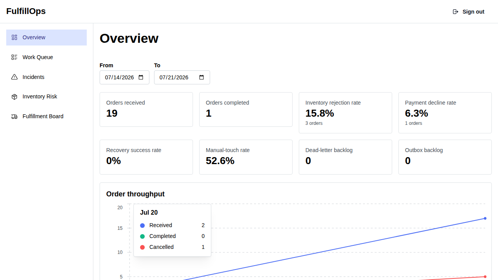
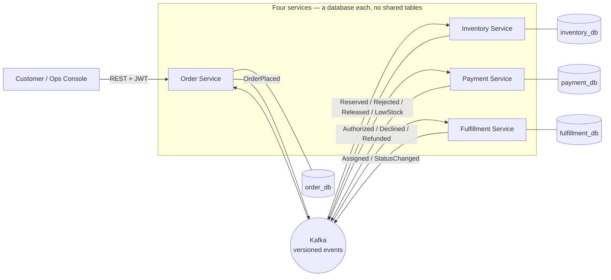
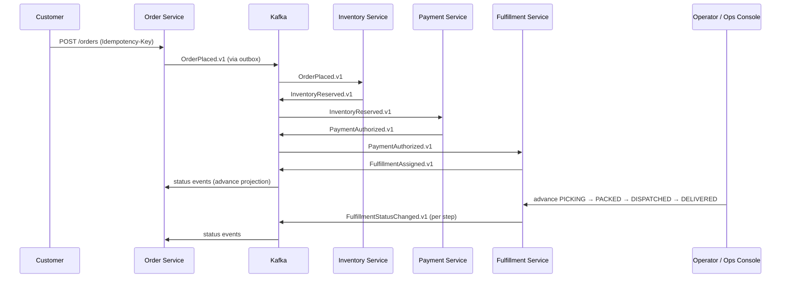
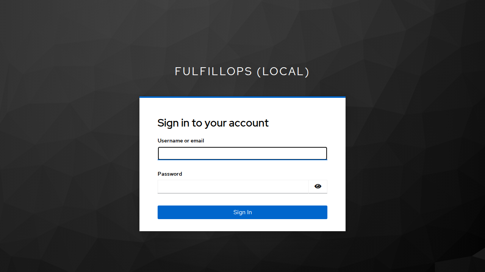
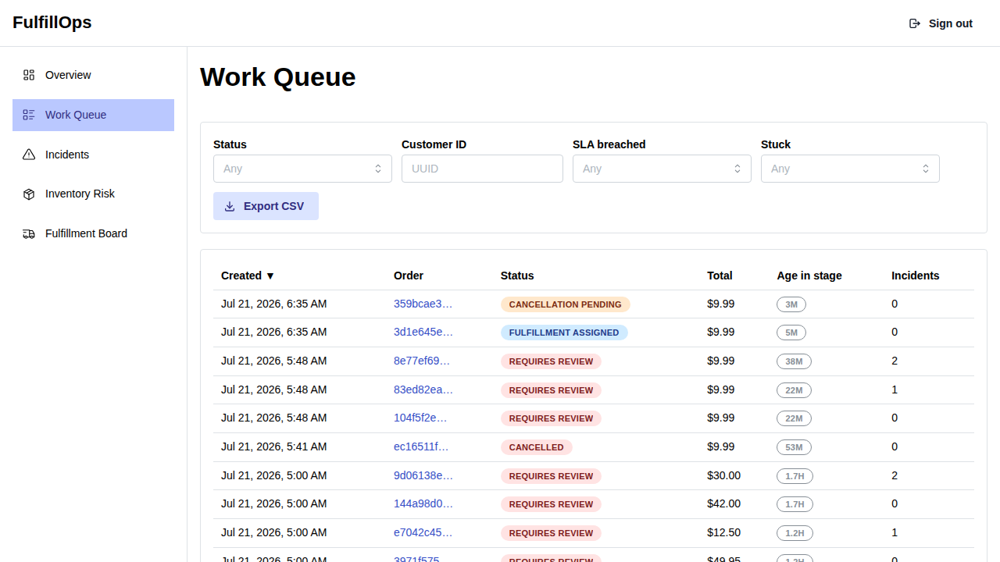
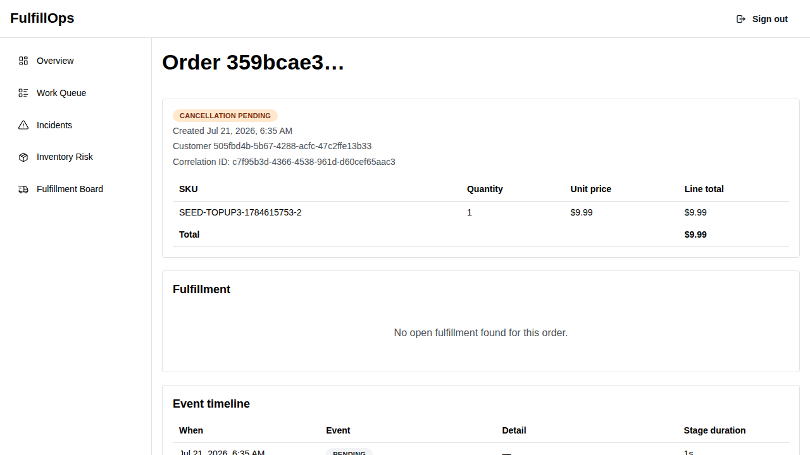
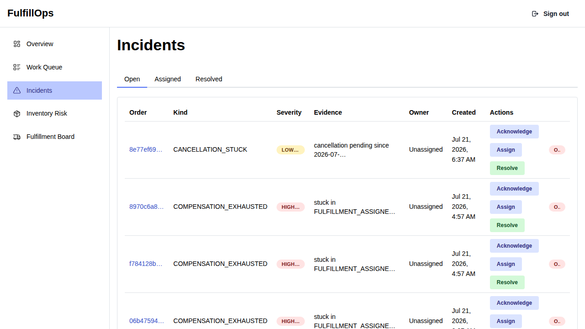
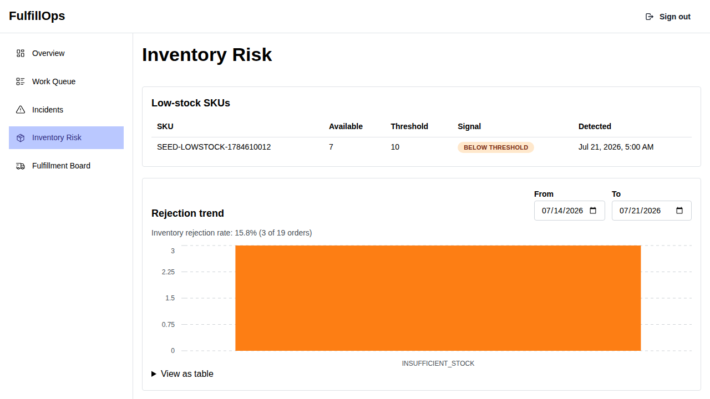
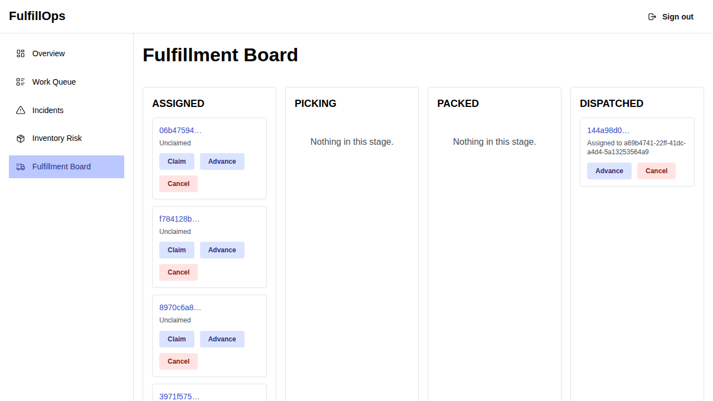

# FulfillOps — Order Fulfillment Operations Platform

An event-driven order fulfillment and operations platform built with Java 21, Spring Boot, Kafka,
PostgreSQL, React, and TypeScript. FulfillOps follows orders across inventory, payment, and warehouse
services while giving operators the dashboards, incident tools, recovery workflows, and reliability
signals needed to keep the pipeline running.

[](https://github.com/AhmedKamal-41/FullOps/actions/workflows/ci.yml)
[](https://github.com/AhmedKamal-41/FullOps/actions/workflows/codeql.yml)


[](LICENSE)

<p align="center">
  
</p>

> Every customer, product, order, credential, warehouse, and financial outcome in this repository is
> fictional demo data. The payment service is a deterministic simulator; no real money or personal
> data is handled.

## Table of contents

- [Overview](#overview)
- [Key features](#key-features)
- [Engineering highlights](#engineering-highlights)
- [Architecture](#architecture)
- [Order lifecycle](#order-lifecycle)
- [Technology stack](#technology-stack)
- [Security implementation](#security-implementation)
- [Reliability, idempotency, and recovery](#reliability-idempotency-and-recovery)
- [Operations and KPIs](#operations-and-kpis)
- [Screenshots](#screenshots)
- [Event and data model](#event-and-data-model)
- [Testing strategy](#testing-strategy)
- [Local setup](#local-setup)
- [Running with Docker Compose](#running-with-docker-compose)
- [Environment variables](#environment-variables)
- [Demo instructions](#demo-instructions)
- [Common commands](#common-commands)
- [Project structure](#project-structure)
- [Known limitations](#known-limitations)
- [Future improvements](#future-improvements)
- [License](#license)

## Overview

Order fulfillment systems fail in the seams between services: an order is placed but stock is never
reserved, a payment is charged but fulfillment never starts, or a warehouse update never makes it back
to the order a customer is watching. FulfillOps is built around that unhappy path — a small but
realistic fulfillment pipeline where failures are expected, detected, and recovered from.

An order travels from placement through inventory reservation, payment authorization, and warehouse
dispatch as four independently deployable services. They coordinate through versioned Kafka events
rather than shared databases or synchronous call chains, so one service being slow or down never
corrupts another's data. When a step fails partway through, the system compensates: it releases
reserved stock, refunds the simulated payment, and — when it cannot safely auto-resolve — hands an
operator a reviewable incident instead of silently losing or duplicating the order.

The operations console gives an operator the other half: KPI dashboards, an SLA-aware work queue,
per-order timelines stitched from every service's events, an incident acknowledge/assign/resolve
workflow, low-stock signals, and dead-letter replay. Together the backend and console demonstrate
Java and Spring Boot service design, Kafka choreography, transactional messaging, concurrency-safe
data handling, reliability and failure recovery, and an operations-focused frontend.

## Key features

- **Idempotent order placement** — a reused idempotency key returns the original result; the same key
  with a different payload is rejected as a conflict, so a retrying client never creates a duplicate
  order or a silent wrong one.
- **Race-safe inventory reservations** — concurrent orders for the same SKU can never oversell;
  stock is reserved under database locking, and the loser retries rather than corrupting the count.
- **Deterministic payment simulator** — authorizations, declines, and refunds are decided by seeded
  amounts, so failure and retry behavior is reproducible in demos and tests without any real gateway.
- **Warehouse fulfillment state machine** — operators advance orders through
  `PICKING → PACKED → DISPATCHED → DELIVERED`, with status only ever moving forward.
- **Event-driven cancellation and compensation** — a cancellation releases stock, refunds payment,
  and cancels the fulfillment, finalizing only once every required compensation is confirmed.
- **Dead-letter persistence and audited replay** — a message that exhausts its retry budget is stored
  intact; an ADMIN can replay the original persisted event by id, never by supplying a new payload.
- **Stuck-order reconciliation** — a background job finds orders that stopped making progress and
  either safely nudges them or escalates them to human review.
- **Operator work queue** — a searchable, filterable, SLA-breach-aware backlog of live orders.
- **KPI and backlog dashboards** — throughput, stage durations, cancellation and failure rates, and
  messaging backlogs, each with a documented formula.
- **Incident workflow** — acknowledge, assign, and resolve incidents, with a full audited action
  history per order.
- **Low-stock signals** — SKUs that cross a threshold surface to operators via an edge-triggered event.
- **CSV export** — the work queue exports for offline triage.
- **Keycloak authentication and role authorization** — CUSTOMER, OPERATOR, and ADMIN roles enforced
  at both the URL and service layers.
- **Distributed tracing, metrics, dashboards, and alerts** — one order follows as a single trace
  across all four services and every Kafka hop.

## Engineering highlights

- **Database per service, no cross-service reads.** Each service owns one PostgreSQL database and has
  no network or credential access to another's — preventing the hidden coupling of a distributed
  monolith where one schema change silently breaks another service.
- **Transactional outbox.** Each service writes an event to an `outbox_event` table in the same
  transaction as its state change; a relay publishes it afterward. This prevents the classic gap where
  a database commit succeeds but the Kafka publish fails (or vice versa), leaving the rest of the
  system unaware of a change that happened.
- **Idempotent inbox consumers.** Every consumer records `(event_id, consumer_name)` and skips events
  it has already applied, so Kafka's redelivery can never double-reserve stock, double-charge, or
  double-create a fulfillment.
- **Versioned JSON Schema event contracts.** Events are validated against schemas in `contracts/`
  rather than a shared Java module, preventing the build-time coupling a shared model reintroduces; a
  breaking change ships as a new `eventVersion`.
- **At-least-once delivery, made correct by design.** The system assumes redelivery everywhere and
  never claims exactly-once — correctness comes from the inbox plus database uniqueness constraints,
  not from a delivery guarantee Kafka cannot give.
- **Optimistic locking prevents overselling.** Stock levels carry a `version` column; a concurrent
  reservation that loses the compare-and-swap retries in a fresh transaction rather than writing a
  negative quantity.
- **Compensation by choreography.** Each service releases, refunds, or cancels what it owns in
  response to a cancellation event — no central coordinator reaches into another service to undo work.
- **Bounded retry, then dead-letter.** Consumers use Spring Kafka's `@RetryableTopic` with exponential
  backoff; a non-retryable business rejection skips retries entirely, and a poison message is routed
  to a dead-letter topic instead of blocking its partition.
- **Reconciliation under a PostgreSQL advisory lock.** The stuck-order job holds a session-scoped
  advisory lock on one dedicated connection for the whole pass, so exactly one instance ever acts —
  preventing two schedulers from double-nudging the same order.
- **Rebuildable operations projection.** Order Service's read model is recomputed from its own durable
  tables, not by replaying Kafka (whose retention is finite), so it is always reconstructable.
- **Redis failure fallback.** Every cache read is wrapped so a Redis outage degrades straight to
  PostgreSQL and shows up only as a metric, never a failed request — the cache is never a system of
  record.
- **Resilience4j retry and circuit breaker** around the payment provider call, wired from the
  framework-agnostic core libraries; a business decline is a return value, never an exception, so it
  can never trip the breaker.
- **RFC 9457 Problem Details** for every HTTP error — no stack traces or secrets leak to a caller.
- **OpenTelemetry context propagation** across HTTP, Kafka, and the outbox boundary, so an order is
  one continuous trace end to end.
- **Testcontainers integration tests** exercise the parts that are only real against real
  infrastructure — migrations, outbox/inbox, concurrency, retry/DLT, saga, and reconciliation.

## Architecture

Four backend services split by business capability, each owning its own database and coordinating only
through Kafka events. The React console talks to service HTTP APIs — mostly Order Service's operations
projection and Fulfillment Service's action endpoints — and never touches a database or Kafka directly.

| Component | Responsibility | Main technology |
|---|---|---|
| Order Service | Order lifecycle, cancellation, reconciliation, operations projection | Spring Boot, PostgreSQL, Kafka |
| Inventory Service | Products, stock, race-safe reservations and releases | Spring Boot, PostgreSQL, Redis, Kafka |
| Payment Service | Deterministic authorization, declines, refunds, provider resilience | Spring Boot, PostgreSQL, Resilience4j, Kafka |
| Fulfillment Service | Warehouse assignment and fulfillment state transitions | Spring Boot, PostgreSQL, Kafka |
| Ops Console | KPIs, work queue, order timelines, incidents, fulfillment actions | React, TypeScript |
| Identity | Authentication and CUSTOMER/OPERATOR/ADMIN roles | Keycloak |
| Observability | Metrics, traces, dashboards, and alerting | Prometheus, Tempo, Grafana, OpenTelemetry |



Deeper design, data ownership, the full state machine, and the key engineering decisions are in
[`docs/ARCHITECTURE.md`](docs/ARCHITECTURE.md).

## Order lifecycle

1. A customer submits an order with an idempotency key.
2. Order Service persists the order and an `OrderPlaced.v1` outbox event atomically.
3. Inventory Service reserves or rejects stock.
4. Payment Service authorizes or declines the simulated payment.
5. Fulfillment Service assigns warehouse work.
6. An operator advances the fulfillment through its stages.
7. Order Service consumes every service's events to keep its operations projection current.
8. A failure at any step triggers compensation or, if it cannot be auto-resolved, operator review.



**Cancellation and compensation.** A cancellation before dispatch releases stock, refunds the payment,
and cancels the fulfillment — each service reacting independently to `OrderCancellationRequested.v1`
and Order Service finalizing to `CANCELLED` only once every required compensation is confirmed. A
declined payment or rejected inventory triggers the same choreography automatically. A cancellation at
or after dispatch is never automated — goods are in transit, so it becomes an operator incident.

## Technology stack

| Layer | Technology |
|---|---|
| Language / runtime | Java 21 |
| Backend framework | Spring Boot 4.1, Spring Data JPA, Spring Security OAuth2 Resource Server |
| Messaging | Apache Kafka (Spring Kafka `@RetryableTopic`) |
| Persistence | PostgreSQL, Flyway migrations |
| Cache | Redis (disposable caches only) |
| Resilience | Resilience4j (retry + circuit breaker) |
| Identity | Keycloak (OIDC) |
| Frontend | React 19, TypeScript, TanStack Query, Vite |
| Build | Maven (wrapper included) |
| Backend testing | JUnit 5, Mockito, Testcontainers, ArchUnit |
| Frontend / e2e testing | Vitest, Playwright |
| Load testing | k6 |
| Observability | OpenTelemetry, Micrometer, Prometheus, Grafana, Tempo |
| Packaging | Docker Compose, Kubernetes (Kustomize), Terraform (AWS reference) |
| CI/CD | GitHub Actions, Dependabot, CodeQL |

## Security implementation

- **Keycloak OIDC** issues tokens; each service is a native Spring Security OAuth2 Resource Server that
  validates them and never issues them.
- **Authorization Code with PKCE** for the browser console; tokens are kept in memory, never in
  `localStorage`.
- **JWT issuer and audience validation** on every request — the token must carry the `fulfillops-api`
  audience.
- **CUSTOMER, OPERATOR, and ADMIN roles**, enforced by URL rules and service-layer ownership checks; a
  non-owner read returns `404`, not `403`.
- **RFC 9457 Problem Details** for every error — no stack traces or secrets leak.
- **No card, bank-account, or SSN handling** — the payment service is a deterministic simulator; all
  credentials and data are fictional.
- **Environment-based secrets** with no defaults; `.env` is git-ignored and never committed. Container
  images run as a non-root user.

Full model and threat summary: [`SECURITY.md`](SECURITY.md).

## Reliability, idempotency, and recovery

Each mechanism below states the failure it prevents, where it lives, and how it is tested.

| Mechanism | Prevents | Where | Tested by |
|---|---|---|---|
| Order-placement idempotency | Duplicate or silently-wrong orders on retry | Order Service command layer | Web-slice + integration tests |
| Transactional outbox | A committed state change whose event never publishes | `outbox_event` + relay, every service | Outbox relay integration tests |
| Inbox deduplication | Double-processing under redelivery | `(event_id, consumer_name)` inbox, every consumer | Duplicate-delivery integration tests |
| Reservation locking | Overselling under concurrent demand | Inventory Service, `SELECT … FOR UPDATE` + optimistic version | Reservation concurrency integration tests |
| Bounded retry → dead-letter | A poison message blocking its partition | Spring Kafka `@RetryableTopic` + `@DltHandler` | Poison-message integration tests |
| Exact-payload replay | Injecting a fabricated event during recovery | ADMIN dead-letter endpoint (replays by id) | Dead-letter replay controller tests |
| Compensation | A half-completed order left inconsistent | Choreographed release/refund/cancel per service | Cancellation saga integration tests |
| Reconciliation (advisory lock) | Stuck orders lost silently; double-nudging | Order Service scheduler under `pg_advisory_lock` | Reconciliation integration tests |
| Circuit breaker | Hammering a failing payment provider | Resilience4j around the provider call | Payment resilience unit tests + failure scenario |
| Redis fallback | A cache outage becoming a failed request | Wrapped cache reads → PostgreSQL | Redis-outage failure scenario |

Delivery is **at least once, never exactly once** — the project does not claim otherwise. See
[`docs/ARCHITECTURE.md`](docs/ARCHITECTURE.md#at-least-once-delivery-and-idempotency).

## Operations and KPIs

The console lets an operator inspect KPIs, filter the work queue, identify SLA breaches, inspect order
timelines, acknowledge/assign/resolve incidents, replay dead-lettered events, manage fulfillment
states, monitor low-stock signals, and export CSV data.

| KPI | Operational use |
|---|---|
| Order throughput | Understand incoming and completed workload |
| Stage duration | Find slow fulfillment stages |
| SLA breach count | Prioritize delayed work |
| Cancellation rate | Detect downstream problems |
| Payment technical-failure rate | Identify provider instability |
| DLT backlog | Detect unprocessed event failures |
| Outbox backlog | Detect event-publication problems |
| Manual-touch rate | Measure orders requiring operator intervention |

Every number has an exact formula in [`docs/KPI_DICTIONARY.md`](docs/KPI_DICTIONARY.md). Incident and
recovery playbooks are in [`docs/OPERATIONS_RUNBOOK.md`](docs/OPERATIONS_RUNBOOK.md).

## Screenshots

Captured from the operations console's self-contained demo mode (not a live backend).

| | |
|---|---|
| <br>**Login** — role-based sign-in via Keycloak. | <br>**Overview** — headline KPIs to see pipeline health at a glance. |
| <br>**Work Queue** — an SLA-aware backlog to prioritize live work. | <br>**Order Detail** — one order's full timeline across services. |
| <br>**Incidents** — acknowledge, assign, and resolve exceptions. | <br>**Inventory Risk** — SKUs that crossed a low-stock threshold. |
| <br>**Fulfillment Board** — fulfillments grouped by workflow stage. | |

## Event and data model

Each service owns its own PostgreSQL database — there are no shared tables. Event contracts are JSON
Schema documents; every event uses a common envelope, and its `aggregateId` is normally the order ID
(one documented exception: SKU-scoped low-stock signals). Each service keeps its own outbox and inbox,
and Order Service owns the operations projection built from every service's events.

| Event | Producer | Meaning |
|---|---|---|
| `OrderPlaced.v1` | Order | An order was accepted (`PENDING`). |
| `InventoryReserved.v1` | Inventory | Stock reserved for the order. |
| `InventoryRejected.v1` | Inventory | Not enough stock; nothing reserved. |
| `InventoryReleased.v1` | Inventory | A prior reservation was released (compensation). |
| `PaymentAuthorized.v1` | Payment | Simulated payment authorized. |
| `PaymentDeclined.v1` | Payment | Simulated payment declined (never retried). |
| `PaymentRefunded.v1` | Payment | A prior authorization was refunded. |
| `FulfillmentAssigned.v1` | Fulfillment | A fulfillment was created and assigned (`ASSIGNED`). |
| `FulfillmentStatusChanged.v1` | Fulfillment | The fulfillment moved to a new status (incl. `CANCELLED`). |
| `OrderCancellationRequested.v1` | Order | A cancellation needs compensation from the services holding state. |
| `OrderCancelled.v1` | Order | The order reached the terminal `CANCELLED` state. |
| `OrderRequiresReview.v1` | Order | The order could not be auto-resolved and needs an operator. |
| `InventoryLowStock.v1` | Inventory | A SKU crossed its configured low-stock threshold. |

Full catalog: [`docs/EVENT_CATALOG.md`](docs/EVENT_CATALOG.md). Wire format and schemas:
[`contracts/README.md`](contracts/README.md).

## Testing strategy

| Layer | Tool | What it verifies |
|---|---|---|
| Unit | JUnit 5, Mockito | Business rules and calculations |
| Web slice | Spring MVC Test, Spring Security Test | Validation and authorization |
| Integration | Testcontainers | PostgreSQL, Kafka, Redis, migrations, concurrency and messaging |
| Contract | JSON Schema validation | Event examples match their schemas |
| Frontend | Vitest | Components, hooks, and UI behavior |
| End-to-end | Playwright | Operator workflows |
| Performance | k6 | Reproducible load scenarios |
| Architecture | ArchUnit | Service and package boundaries |

Full strategy and commands: [`docs/TESTING.md`](docs/TESTING.md). Raw k6 summaries:
[`docs/evidence/k6/`](docs/evidence/k6/).

## Local setup

**Prerequisites:** JDK 21 and Docker (Maven is bundled via `./mvnw`). Node 20+ for the console.

```bash
# 1. Clone
git clone https://github.com/AhmedKamal-41/FullOps.git
cd FullOps

# 2. Copy the fictional local environment file
cp .env.example .env

# 3. Start infrastructure (PostgreSQL, Kafka, Redis, Keycloak) and wait until healthy
make infra-up

# 4. Start each service (one per terminal), against the running infra
make run-order
make run-inventory
make run-payment
make run-fulfillment

# 5. Start the operations console
cd apps/ops-console && npm install && npm run dev

# 6. Open the console
open http://localhost:5173
```

Sign in with a fictional demo user (`operator.demo` / `OperatorDemo!123`).

## Running with Docker Compose

```bash
make infra-up             # infrastructure only (Postgres, Kafka, Redis, Keycloak)
make demo-up              # full containerized demo: infra + observability + all four services
make infra-status         # container health at a glance
make infra-down           # stop, preserving data in named volumes
make infra-down DOWN_ARGS=-v   # DESTRUCTIVE: stop and delete all volumes/data
```

The observability stack (Prometheus, Grafana, Tempo) comes up with `make demo-up`; Grafana is at
`http://localhost:3000`.

## Environment variables

All values in `.env.example` are fictional and valid only against the local stack. The essentials:

| Variable | Purpose | Safe local example | Sensitive |
|---|---|---|---|
| `ORDER_SERVICE_PORT` | Order Service HTTP port | `8081` | no |
| `DB_HOST` / `DB_PORT` | PostgreSQL host and port | `localhost` / `5432` | no |
| `ORDER_DB_USERNAME` / `ORDER_DB_PASSWORD` | Order Service database credentials | `order_service` / `order-db-local-only-pw` | yes (local-only) |
| `KAFKA_BOOTSTRAP_SERVERS` | Kafka bootstrap address | `localhost:9092` | no |
| `REDIS_HOST` / `REDIS_PASSWORD` | Redis cache | `localhost` / local-only | yes (local-only) |
| `OIDC_ISSUER_URI` | Keycloak realm issuer | `http://localhost:8080/realms/fulfillops` | no |

The four services each have their own `*_DB_*` credentials. See [`.env.example`](.env.example) for the
complete list.

## Demo instructions

A five-minute walkthrough:

1. Start the demo: `cp .env.example .env`, `make infra-up`, then `scripts/seed-demo-data.sh`.
2. Log in as an operator (`operator.demo`, fictional/local-only) at `http://localhost:5173`.
3. View the KPI overview.
4. Inspect the work queue and its SLA-breach markers.
5. Open an order timeline stitched from four services' events.
6. Acknowledge and assign a seeded incident.
7. Advance a fulfillment through its stages.
8. Run one failure/recovery scenario: `tests/failure-scenarios/payment-outage-recovery.sh`.

Full walkthrough: [`docs/DEMO.md`](docs/DEMO.md). All demo users and data are fictional.

## Common commands

| Command | Purpose |
|---|---|
| `make infra-up` | Start local infrastructure |
| `make infra-down` | Stop infrastructure |
| `make demo-up` | Start the complete containerized demo |
| `make smoke` | Run authentication smoke checks |
| `make verify-all` | Run the broad local verification |
| `./mvnw -B test` | Run backend unit and web-slice tests |
| `./mvnw -B verify` | Run backend unit and integration verification |
| `npm test -- --run` | Run frontend tests (in `apps/ops-console`) |
| `npm run build` | Build the operations console (in `apps/ops-console`) |

## Project structure

```
services/            # order / inventory / payment / fulfillment — a Spring Boot module each
apps/ops-console/    # React + TypeScript operations console
contracts/           # JSON Schema event contracts + validation test (no production code)
infra/               # Docker Compose, Kubernetes (Kustomize), Terraform (AWS reference), Keycloak realm
tests/               # failure-scenario scripts and k6 load tests
scripts/             # smoke, seed, demo, kind-deploy, verify-all, audit-repo
docs/                # architecture, events, KPIs, testing, security, runbook, demo, limitations
.github/workflows/   # CI, CodeQL, release, Terraform checks
```

## Known limitations

- Payment is a deterministic simulator, not a real gateway.
- Kafka delivery is at least once; the project never claims exactly-once.
- Local Kafka and Redis are single-node; Postgres is one instance with a database per service.
- Kubernetes and Terraform are deployment references — validated, but not applied to a real cloud.
- Some admin operations (refunds, inventory adjustments) are API-only, with no console screen yet.
- Grafana and distributed-trace screenshots require a locally running observability stack.

Full list: [`docs/KNOWN_LIMITATIONS.md`](docs/KNOWN_LIMITATIONS.md).

## Future improvements

- Console screens for refunds and inventory adjustments.
- Fleet-wide dead-letter and outbox visibility aggregated across all services.
- Production identity federation beyond the local Keycloak realm.
- Multi-region or high-availability infrastructure.
- A live hosted demo with sanitized observability evidence.

## License

Released under the [MIT License](LICENSE).
