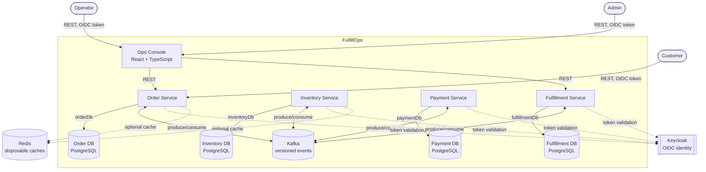

# Architecture

> Status: design only. No service in this document is implemented yet — see [`PHASE_STATUS.md`](PHASE_STATUS.md).

## Overview

FulfillOps is four independently deployable domain services plus one frontend, coordinating through Kafka instead of synchronous calls or a shared database:

- **Order Service** — order intake, idempotent order placement, the customer-facing order view, and the operations projection used by the ops console.
- **Inventory Service** — stock levels and concurrency-safe reservation/release.
- **Payment Service** — a deterministic, fictional payment authorization/decline/refund simulator.
- **Fulfillment Service** — the warehouse workflow state machine and operator actions.
- **Ops Console** (`apps/ops-console`) — a React + TypeScript operations UI, talking only to service HTTP APIs (primarily Order Service's operations projection and Fulfillment Service's action endpoints).

Each service owns exactly one PostgreSQL database. No service connects to another service's database, and there is no shared JPA/domain-model module — see [ADR 0001](adr/0001-service-boundaries.md) and [ADR 0002](adr/0002-choreography-not-orchestration.md).

## System context

## Service boundaries and data ownership

- Each service owns exactly one PostgreSQL schema/database and applies its own Flyway migrations independently.
- Cross-service reads happen only through a service's public HTTP API or through Kafka events it has chosen to publish — never through direct database access. See [ADR 0001](adr/0001-service-boundaries.md).
- There is no shared JPA entity module. Services that need to agree on shape (e.g., an event payload) share a JSON Schema contract in `contracts/`, not a Java class. See [ADR 0005](adr/0005-json-schema-event-contracts.md).

## Event-driven choreography

Services coordinate through Kafka events rather than a central orchestrator/saga engine. Each service reacts to the events it cares about and emits its own events in response — see [ADR 0002](adr/0002-choreography-not-orchestration.md). Reliable delivery from each service's database transaction to Kafka uses the transactional outbox pattern on the producer side and an idempotent inbox (deduplication by `eventId`) on the consumer side — see [ADR 0003](adr/0003-outbox-inbox.md).

Kafka delivery is at least once, never exactly once. Every consumer must be safe to run twice on the same event — see [ADR 0004](adr/0004-at-least-once-delivery.md). Every event envelope carries `eventId`, `eventType`, `eventVersion`, `occurredAt`, `correlationId`, `causationId`, `aggregateId`, `producer`, and `payload`, which is enough to deduplicate, trace, and version independently per event type.

## Operations projection

Order Service owns a read-optimized operations projection, built by consuming lifecycle events from every other service (inventory, payment, fulfillment). This keeps the ops console's primary data source to one service instead of aggregating live calls to four, at the cost of Order Service needing to consume events it does not otherwise care about for its own domain logic — see [ADR 0008](adr/0008-ops-projection-ownership.md).

## Identity and secrets

Keycloak provides OIDC identity for local development; each backend service is a Spring Security OAuth2 Resource Server validating bearer tokens against it. Three roles are recognized: `CUSTOMER`, `OPERATOR`, `ADMIN` — see [ADR 0007](adr/0007-keycloak-oidc.md). No service stores real payment-card data or real PII; the payment service is a deterministic simulator.

## Redis

Redis is used only for disposable, rebuildable caches (for example, hot-path read caching). No service treats Redis as a system of record — losing the cache must never lose or corrupt data.

## Frontend

`apps/ops-console` is a React + TypeScript single-page application for operators and admins. It calls only HTTP APIs (primarily Order Service's operations projection endpoints and Fulfillment Service's operator-action endpoints) and holds no direct database or Kafka access.

## Explicitly excluded

No API gateway, service discovery, GraphQL, Kubernetes operators, or machine learning/AI components are part of this architecture. Kubernetes and Terraform artifacts under `infra/` are later packaging exercises evaluated independently of local development, which runs entirely on Docker Compose.

## Related documents

- [`DOMAIN_MODEL.md`](DOMAIN_MODEL.md) — entities, statuses, events, invariants, and compensation rules, including the order lifecycle and payment-decline compensation diagrams.
- [`adr/`](adr/) — the reasoning behind each boundary and technology decision listed above.
