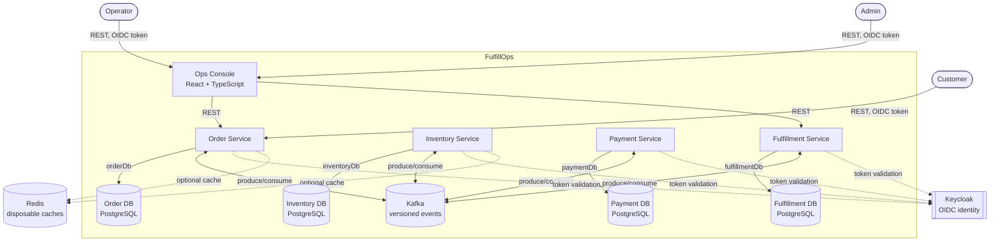
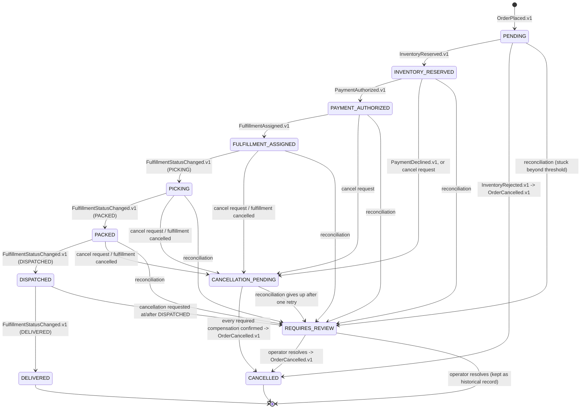
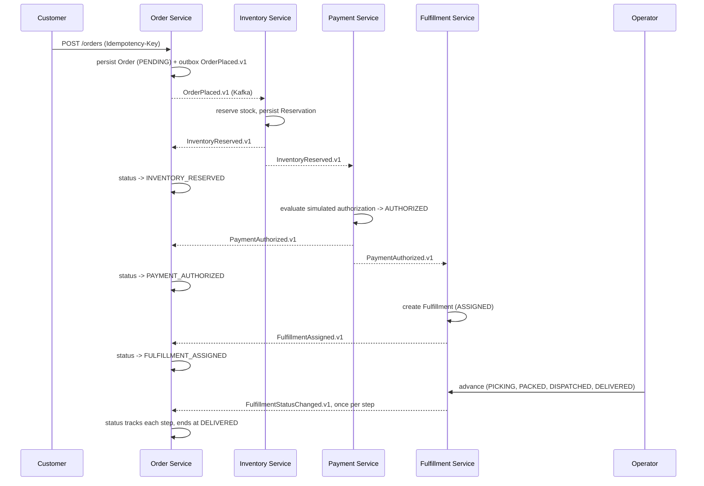

# Architecture

FulfillOps is four independently deployable domain services plus one operations console,
coordinating through Kafka events instead of synchronous calls or a shared database.

- **Order Service** — order intake, idempotent placement, the customer-facing order view, the
  cancellation saga, reconciliation, and the operations projection the console reads from.
- **Inventory Service** — stock levels and concurrency-safe reservation/release.
- **Payment Service** — a deterministic, fictional authorization/decline/refund simulator.
- **Fulfillment Service** — the warehouse workflow state machine and operator actions.
- **Ops Console** (`apps/ops-console`) — a React + TypeScript UI that talks only to service HTTP
  APIs (mainly Order Service's operations projection and Fulfillment Service's action endpoints).

Each service owns exactly one PostgreSQL database. No service connects to another service's
database, and there is no shared JPA or domain-model module — services share event schemas, not
persistence entities.

## System context

## Service responsibilities and data ownership

| Service | Owns | Does not own |
|---|---|---|
| Order Service | `Order`, `OrderItem`, idempotency records, the cancellation saga, the operations projection, incidents | stock levels, payment state, warehouse state |
| Inventory Service | `Product`, `StockLevel`, `InventoryReservation`, `InventoryAdjustment` | order data, payment data |
| Payment Service | `Payment`, `PaymentAttempt`, `Refund`, `SimulatorRule`, `OrderPaymentContext` | order data, inventory data |
| Fulfillment Service | `Fulfillment`, `FulfillmentStatusHistory` | order data, payment data, inventory data |

Each service applies its own Flyway migrations. Cross-service reads happen only through a
service's public HTTP API or through the Kafka events it publishes — never through direct database
access. Every cross-service fact ("was payment authorized?") is learned by consuming that owner's
events, not by querying its database. Some data is deliberately duplicated (Order Service keeps a
read-only projection of fulfillment status) in exchange for independence.

### Key domain entities

- **Order** — `orderId` (application-generated UUID), `customerId`, idempotency key and payload
  fingerprint, `items`, `totalAmount` (`BigDecimal`), `currency`, `status`, UTC `Instant`
  timestamps. Line items carry `sku`, integer `quantity`, and `unitPrice`.
- **StockLevel** — `sku`, `availableQuantity`, `reservedQuantity`, and a `version` column for
  optimistic locking. `InventoryReservation` is one row per order (not per SKU), so a multi-item
  order reserves atomically as a whole. `InventoryAdjustment` is an append-only audit row for every
  stock mutation.
- **Payment** — `paymentId`, `orderId` (unique), `amount`, `currencyCode`, `status`
  (`AUTHORIZED`/`DECLINED`/`REFUNDED`). `PaymentAttempt` records every attempt against the
  simulated provider, including ones that never produced a `Payment` row. `OrderPaymentContext` is
  Payment Service's own small projection built from `OrderPlaced.v1` — order id, customer id,
  amount, currency only; never line items, never anything card- or PII-shaped.
- **Fulfillment** — `fulfillmentId`, `orderId` (unique), `status`, a deterministically assigned
  fictional `warehouseId`, optional `assigneeId`, `slaDueAt`, and a `trackingReference` set on
  dispatch. `FulfillmentStatusHistory` is append-only.

## Order state machine

`CANCELLATION_PENDING` tracks exactly which of {inventory release, payment refund, fulfillment
cancellation} an order actually needs — computed once, from what had already happened at the moment
cancellation started, and recorded in an `order_cancellation` row rather than in the order's status
alone. Cancellation once a fulfillment reaches `DISPATCHED` is never automated: goods are physically
in transit, so that case always routes to `REQUIRES_REVIEW` for a human decision. Reconciliation can
escalate an order stuck in any non-terminal happy-path status straight to `REQUIRES_REVIEW`.

### Invariants

- Inventory: `reservedQuantity + availableQuantity` never exceeds total stock for a SKU, and
  `availableQuantity` is never negative, even under concurrent reservation attempts for the same SKU.
- Payment: at most one non-refunded `Payment` per order (unique `order_id`), and at most one
  `Refund` per `Payment` (unique `payment_id`).
- Fulfillment: status only moves forward (`ASSIGNED → PICKING → PACKED → DISPATCHED → DELIVERED`),
  except operator-triggered `CANCELLED`, which is only reachable before `DISPATCHED`.
- Order: an idempotency key reused with a different request payload is rejected as a conflict,
  never treated as a duplicate success.
- Every consumer is idempotent by `eventId` — redelivery must not double-reserve, double-charge, or
  double-create a fulfillment.
- An order reaches `CANCELLED` only once every compensation its `order_cancellation` row requires
  has been confirmed — never on a partial set, and never twice.

## Kafka topics and event flow

One topic per producing service, named `fulfillops.<service>.events` (not one topic per event
type). The Kafka message key is the order ID (`aggregateId`), so every event in one order's saga —
across all four services — lands on the same partition, giving per-order ordering for free and
letting Order Service build its operations projection by grouping on one field. `eventId`,
`eventType`, `eventVersion`, `correlationId`, and `causationId` also ride along as Kafka headers so
tooling can identify a message without deserializing the JSON body (which remains the source of
truth).

| Topic | Producer |
|---|---|
| `fulfillops.order.events` | Order Service |
| `fulfillops.inventory.events` | Inventory Service |
| `fulfillops.payment.events` | Payment Service |
| `fulfillops.fulfillment.events` | Fulfillment Service |

Every envelope carries `eventId`, `eventType`, `eventVersion`, `occurredAt`, `correlationId`,
`causationId`, `aggregateId`, `producer`, and `payload`. The full event list, producers, and
consumers are in [`EVENT_CATALOG.md`](EVENT_CATALOG.md); the machine-validated wire format is in
[`../contracts/README.md`](../contracts/README.md).

### Happy-path lifecycle

## Transactional outbox and idempotent inbox

Services coordinate through choreography — each reacts to the events it needs and emits its own,
with no central orchestrator. Reliable delivery from a database transaction to Kafka uses the
transactional outbox on the producer side and an idempotent inbox on the consumer side.

- **Outbox.** Each service writes an event to its `outbox_event` table in the same transaction as
  its domain state change. A scheduled relay polls due rows (`FOR UPDATE SKIP LOCKED`), publishes
  them, and marks a row sent only after the broker acknowledges. A domain change and the fact that
  it happened are therefore never inconsistent — either both commit or neither does.
- **Inbox.** Each consumer records the `(event_id, consumer_name)` of every event it has processed
  and skips events it has already applied, in the same transaction as the work itself.

### At-least-once delivery and idempotency

Kafka delivery is at least once, never exactly once. Every consumer is written and tested against
redelivery of the same event. The inbox check makes reprocessing a no-op; domain-level uniqueness
constraints (a reservation, payment, or fulfillment keyed by `order_id`) are a second line of
defense if the inbox check is ever bypassed. **The project never claims exactly-once processing.**

## Compensation and reconciliation

Cancellation is choreographed the same way the happy path is. Order Service emits
`OrderCancellationRequested.v1` (or reacts directly to `PaymentDeclined.v1` / `InventoryRejected.v1`,
which need no separate command), and Inventory, Payment, and Fulfillment each independently release,
refund, or cancel whatever they own for that order, if anything. No command travels back to Order
Service, and no service queries another's database to find out what to compensate.

| Trigger | Compensation |
|---|---|
| `InventoryRejected.v1` | Order Service emits `OrderCancelled.v1` directly — nothing was reserved, payment never runs. |
| `PaymentDeclined.v1` | Inventory Service releases the reservation on its own reaction to the same event. Order Service waits for `InventoryReleased.v1`, then finalizes to `CANCELLED`. |
| Cancel request before `DISPATCHED` | Order Service computes which compensations the order needs, records `CANCELLATION_PENDING`, and emits `OrderCancellationRequested.v1`. It finalizes once every required confirmation (`InventoryReleased.v1` / `PaymentRefunded.v1` / a fulfillment cancellation) arrives, in any order. |
| Fulfillment cancelled directly (operator, before `DISPATCHED`) | Fulfillment emits `FulfillmentStatusChanged.v1` (`CANCELLED`); Inventory and Payment react as they would to a cancellation request; Order Service merges into `CANCELLATION_PENDING`. |
| Cancel request at or after `DISPATCHED` | Not automated. Order Service emits `OrderRequiresReview.v1` and opens a `CANCELLATION_AFTER_DISPATCH` incident for an operator. |
| A message fails processing repeatedly | Routed to the service's dead-letter topic after a bounded retry budget, and persisted so an ADMIN can find and replay it. |

**Reconciliation.** Order Service runs a scheduler that finds orders stuck beyond a configurable
threshold — either a cancellation pending past a shorter threshold, or any non-terminal happy-path
status past a longer one — and either safely retries once (a verbatim re-publish of
`OrderCancellationRequested.v1`, safe because every consumer checks its own state first) or escalates
to `REQUIRES_REVIEW` with a deduplicated incident. Exactly one running instance ever acts on a pass:
the scheduler holds a Postgres session-scoped advisory lock on one dedicated JDBC connection for the
whole pass, so a lock acquired in one pooled connection is never orphaned on another.

### Failure categories

1. **Validation failure** — rejected synchronously with an RFC 9457 Problem Details response;
   nothing was persisted.
2. **Business rejection** — a valid request that cannot proceed (insufficient stock, declined
   payment). Handled by the compensation rules above and reflected in order status; never retried.
3. **Transient infrastructure failure** — a timeout or temporary unavailability. Retried
   automatically via a retry topic with backoff.
4. **Poison message** — fails processing repeatedly. Routed to a dead-letter topic after the retry
   budget is exhausted; never silently discarded.
5. **Irrecoverable inconsistency** — compensation itself keeps failing. The order is marked
   `REQUIRES_REVIEW` and surfaced in the incident queue for manual action.

## Operations projection

Order Service owns a read-optimized operations projection, built by consuming lifecycle events from
every other service in addition to its own. This gives the console one dependency for its primary
views instead of four, and lets it filter, sort, and paginate server-side. The projection is
read-only — never used to make authoritative decisions about inventory or payment state — and can
lag the owning service by however long event processing takes; that eventual-consistency window is
accepted and documented, not treated as a bug.

Projection writes happen inside the same `@Transactional` methods that already persist `orders` and
`order_status_history`, so they are atomic with the facts they derive from and inherit idempotency
from the calling listener's inbox check. An ADMIN-only rebuild recomputes the whole projection from
Order Service's own durable tables (not by replaying Kafka, whose retention is finite) — every event
this service ever processed already left a durable row before it advanced past it, so the rebuild is
a complete, deterministic reconstruction. The `/api/v1/ops/**` API (OPERATOR/ADMIN) exposes KPI
reads, a searchable/filterable/CSV-exportable work queue, per-order event timelines, and the
incident acknowledge/assign/resolve lifecycle — see [`KPI_DICTIONARY.md`](KPI_DICTIONARY.md).

Low-stock visibility follows the same events-only rule: Inventory Service emits `InventoryLowStock.v1`
(edge-triggered, only when a SKU crosses its threshold) rather than Order Service querying Inventory's
tables.

## Redis

Redis is used only for disposable, rebuildable caches; no service treats it as a system of record.
Inventory Service's availability read (`GET /api/v1/inventory/{sku}`) is cache-aside, evicted after
every committed reservation/release/adjustment — but PostgreSQL alone, never the cache, decides
whether a reservation succeeds. Order Service's KPI reads cache the expensive aggregate queries the
same way (TTL only). Every Redis call is wrapped so an outage degrades reads straight to PostgreSQL
and shows up only as a cache-failure metric, never a failed request.

## Authentication

Keycloak provides OIDC identity for local development; each backend service is a native Spring
Security OAuth2 Resource Server that validates a bearer JWT on every request and never issues tokens.
Validation checks the issuer and a required `fulfillops-api` audience, and maps Keycloak's
`realm_access.roles` claim to Spring `ROLE_*` authorities. Three roles are recognized —
`CUSTOMER`, `OPERATOR`, `ADMIN` — enforced by both URL rules and service-layer ownership checks. No
service stores real payment-card data or real PII; see [`../SECURITY.md`](../SECURITY.md) for the
full model.

## Observability

Every service exposes `/actuator/prometheus` (Micrometer) and ships OpenTelemetry traces over OTLP.
Trace context is W3C, propagated across HTTP and Kafka — and across the outbox boundary: the outbox
writer captures the active trace context when it writes a row, and the relay resumes it before
publishing, so an order is one continuous trace across all four services and every Kafka hop rather
than a new trace per publish. Structured JSON logs carry `service`, `environment`, `traceId`,
`spanId`, `correlationId`, `eventId`, and `aggregateId`, and never a token or a customer-data
payload. Metrics are bounded-cardinality (stage, outcome, event type — never a per-order or per-user
id). The local Compose stack adds Prometheus, Grafana, and Tempo, with provisioned dashboards and
demo-labeled alert rules for error rate, oldest outbox row, dead-letter growth, stuck orders,
reconciliation failure, and service-down.

## Key engineering decisions

- **Four services split by business capability, each owning its own database.** Real service
  boundaries, not one application in folders. No service has network or credential access to
  another's database; all cross-service communication is HTTP or events. This is what makes the
  outbox/inbox and choreography necessary rather than optional.
- **Choreography, not a central orchestrator.** Each service reacts to events and emits its own.
  No single point of control means no single point of failure for the whole workflow; the cost is
  that the flow is understood by reading event contracts and the state machine, not one file. At
  four services that is a reasonable trade; a much larger participant count would favor an
  orchestrator.
- **Transactional outbox on publish, idempotent inbox on consume.** A domain change and the event
  announcing it commit together, and redelivery is a safe no-op. The cost is an outbox relay and an
  inbox table in every service.
- **Design for at-least-once delivery; never claim exactly-once.** Every consumer is idempotent by
  `eventId` plus domain uniqueness constraints. This is honest about a real Kafka limitation rather
  than a claim that would not survive scrutiny.
- **Versioned JSON Schema event contracts, not shared Java classes.** A shared model module would
  re-introduce the coupling the service split removes. A breaking change ships as a new
  `eventVersion` rather than mutating an existing schema.
- **PostgreSQL per service.** Strong per-service consistency (transactions, unique constraints,
  `SELECT ... FOR UPDATE`) for the invariants that matter most — no oversold inventory, no duplicate
  authorization — while making cross-service joins impossible even by accident.
- **Keycloak for OIDC, a Resource Server per service.** Token validation and role authorization use
  a well-established library consistently, and each service is testable for authorization behavior
  on its own. Production identity federation is out of scope.
- **Order Service owns the operations projection.** The console has one dependency for its primary
  views instead of four. Order Service takes on a read model over facts it does not own the write
  path for, scoped narrowly to reads so it never becomes a second source of truth.
- **Kafka: one topic per producer, keyed by order ID; Spring Kafka's native retry/DLT.** Per-order
  ordering comes for free, and retry/dead-lettering uses first-party `@RetryableTopic` with
  exception-based routing rather than a general-purpose resilience library that has no Kafka
  integration.
- **Resilience4j core libraries for the payment provider call.** The retry and circuit breaker
  around the simulated provider use Resilience4j's framework-agnostic core (`resilience4j-retry`,
  `resilience4j-circuitbreaker`, `resilience4j-micrometer`) wired by hand — a genuinely different
  concern from Kafka consumer retry, and independent of any Spring Boot starter version. A business
  decline is a return value, never an exception, so it can never trigger a retry or count against
  the circuit breaker.

## Not part of the architecture

API gateway, service discovery, service mesh, GraphQL/gRPC, Kubernetes operators, multi-region
deployment, and any ML/AI component. See [`KNOWN_LIMITATIONS.md`](KNOWN_LIMITATIONS.md) for the full
boundary list.

## Related documents

- [`EVENT_CATALOG.md`](EVENT_CATALOG.md) — every event, its producer, and its consumers.
- [`KPI_DICTIONARY.md`](KPI_DICTIONARY.md) — the exact formula behind every operations number.
- [`../SECURITY.md`](../SECURITY.md) · [`TESTING.md`](TESTING.md) · [`KNOWN_LIMITATIONS.md`](KNOWN_LIMITATIONS.md)
- [`OPERATIONS_RUNBOOK.md`](OPERATIONS_RUNBOOK.md) — detect/diagnose/recover playbooks for each incident type.
- [`../contracts/README.md`](../contracts/README.md) — the event envelope and per-event JSON Schema contracts.
