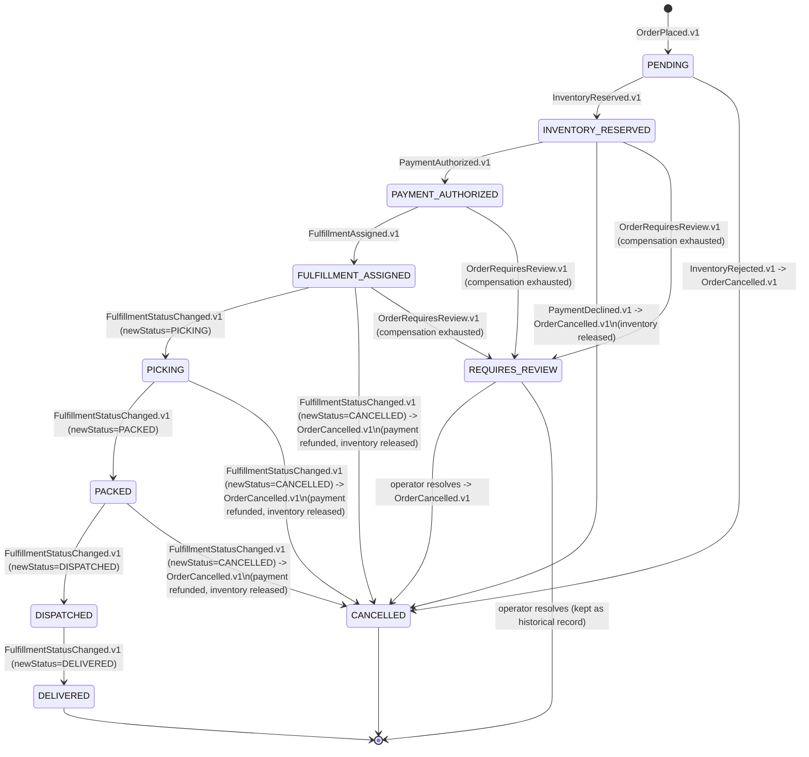
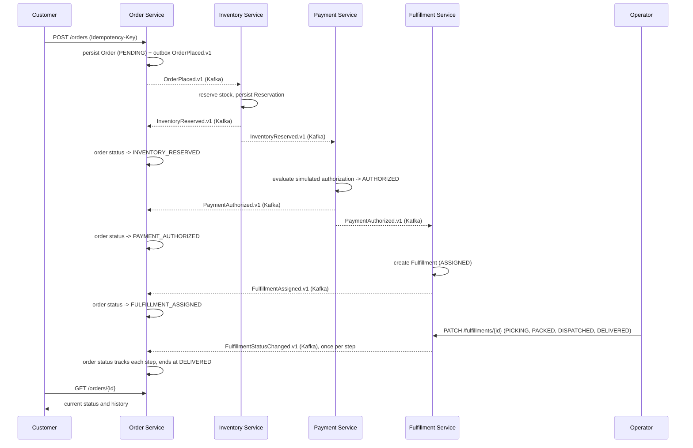
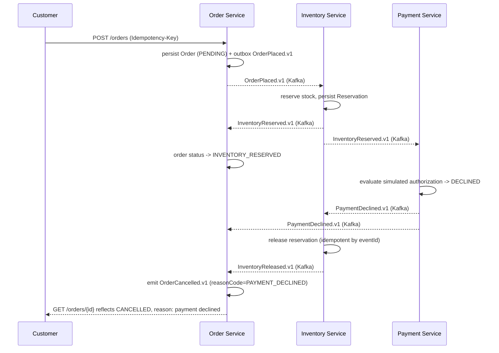

# Domain Model

> Status: the event contracts below are real and enforced — see [`contracts/events/`](../contracts/events/) — and every service has working outbox/inbox messaging infrastructure. Order Service (Phase 4) and Inventory Service (Phase 5) have real entities, command endpoints, and business rules; Payment and Fulfillment do not yet — see [`PHASE_STATUS.md`](PHASE_STATUS.md).

## Service ownership

| Service | Owns | Does not own |
|---|---|---|
| Order Service | `Order`, `OrderItem`, idempotency records, the operations projection | stock levels, payment state, warehouse state |
| Inventory Service | `Product`, `StockItem`, `Reservation` | order data, payment data |
| Payment Service | `PaymentAuthorization` | order data, inventory data |
| Fulfillment Service | `Fulfillment` | order data, payment data, inventory data |

No service reads or writes another service's tables. Every cross-service fact (e.g., "was payment authorized?") is learned by consuming that owner's events, not by querying its database.

## Entities

### Order Service

**`Order`**
- `orderId` (ULID, application-generated)
- `customerId`
- `idempotencyKey`, `idempotencyPayloadFingerprint`
- `correlationId`
- `items: OrderItem[]`
- `totalAmount` (`BigDecimal`), `currency`
- `status` (see state machine below)
- `createdAt`, `updatedAt` (UTC `Instant`)

**`OrderItem`**
- `sku`, `quantity` (integer), `unitPrice` (`BigDecimal`)

**Operations projection** — a read model built from every lifecycle event Order Service consumes (its own, plus Inventory/Payment/Fulfillment events), used by the ops console. Not a separate source of truth; always derivable by replaying events.

### Inventory Service

**`Product`** — a fictional catalog entry: `productId` (UUID), `sku` (unique), `name`, `description`.

**`StockItem`** (implemented as `StockLevel`)
- `sku`, `availableQuantity` (integer), `reservedQuantity` (integer), `version` (optimistic lock — see [`PHASE_STATUS.md`](PHASE_STATUS.md)'s Phase 5 section for the concurrency strategy this enables)

**`Reservation`** (implemented as `InventoryReservation`) — one row per order, not per SKU, so a
multi-item order's reservation is a single aggregate that succeeds or fails atomically as a whole:
- `reservationId` (UUID, application-generated — corrected from this doc's earlier "ULID," which
  no service in this codebase actually uses; every ID here follows `Order.orderId`'s established
  `UUID.randomUUID()` convention), `orderId` (unique), `status` (`RESERVED`, `RELEASED`), `version`
  (optimistic lock)
- `items: ReservationItem[]` — `sku`, `quantity` per line item of the reservation

**`InventoryAdjustment`** — an append-only audit row for every stock mutation, whichever of the
three caused it (`source`: `ADMIN_ADJUSTMENT`, `RESERVATION`, `RELEASE`): `sku`, `changeQuantity`,
`quantityBefore`, `quantityAfter`, `reasonCode`, `reasonDetail`, `actor`, `correlationId`,
`createdAt`.

### Payment Service

**`PaymentAuthorization`**
- `paymentId` (ULID), `orderId`, `amount` (`BigDecimal`), `status` (`AUTHORIZED`, `DECLINED`, `REFUNDED`)

The payment service is a deterministic simulator: it never contacts a real payment network and never stores card data. Decline/success outcomes are derived from a documented, reproducible rule (e.g., a threshold or a designated test amount/customer), not randomness, so tests are stable.

### Fulfillment Service

**`Fulfillment`**
- `fulfillmentId` (ULID), `orderId`, `status` (`ASSIGNED`, `PICKING`, `PACKED`, `DISPATCHED`, `DELIVERED`, `CANCELLED`)

## Order status state machine

Cancellation once a fulfillment reaches `DISPATCHED` is not automated — goods are physically in transit, so that case always routes to `REQUIRES_REVIEW` for a human decision.

## Commands (per service)

| Service | Command | Trigger |
|---|---|---|
| Order | `PlaceOrder` | Customer HTTP request (idempotency key required) |
| Inventory | `ReserveStock` | Consumes `OrderPlaced.v1` |
| Inventory | `ReleaseStock` | Consumes `PaymentDeclined.v1` or `FulfillmentCancelled.v1`, or reconciliation job |
| Payment | `AuthorizePayment` | Consumes `InventoryReserved.v1` |
| Payment | `RefundPayment` | Consumes `FulfillmentCancelled.v1`, or reconciliation job |
| Fulfillment | `AssignFulfillment` | Consumes `PaymentAuthorized.v1` |
| Fulfillment | `AdvanceFulfillment` (`StartPicking`, `MarkPacked`, `MarkDispatched`, `MarkDelivered`) | Operator HTTP request; each emits `FulfillmentStatusChanged.v1` with the corresponding `newStatus` |
| Fulfillment | `CancelFulfillment` | Operator HTTP request, allowed only before `DISPATCHED`; emits `FulfillmentStatusChanged.v1` with `newStatus=CANCELLED` |

## Versioned events

All envelopes carry `eventId`, `eventType`, `eventVersion`, `occurredAt`, `correlationId`, `causationId`, `aggregateId`, `producer`, `payload`. This is now a real, machine-validated contract, not just prose — see [`contracts/events/`](../contracts/events/) for the JSON Schema for the envelope and every event below, with example fixtures. `aggregateId` is the order ID for every event regardless of producer (see `contracts/events/README.md` for why); each service's own internal ID (a reservation, payment, or fulfillment ID) travels in `payload` instead.

| Event | Producer | Meaning |
|---|---|---|
| `OrderPlaced.v1` | Order | A new order was accepted and persisted as `PENDING`. |
| `InventoryReserved.v1` | Inventory | Stock was reserved for every line item. |
| `InventoryRejected.v1` | Inventory | At least one line item could not be reserved. No `Reservation` exists to release later. |
| `InventoryReleased.v1` | Inventory | A prior reservation was released back to available stock. |
| `PaymentAuthorized.v1` | Payment | The simulated payment was authorized. |
| `PaymentDeclined.v1` | Payment | The simulated payment was declined — a business rejection, never retried. |
| `PaymentRefunded.v1` | Payment | A prior authorization was refunded. |
| `FulfillmentAssigned.v1` | Fulfillment | A fulfillment record was created, status `ASSIGNED`. |
| `FulfillmentStatusChanged.v1` | Fulfillment | The fulfillment moved to a new status (`PICKING`, `PACKED`, `DISPATCHED`, `DELIVERED`, or `CANCELLED`) — one generic event instead of one type per status; consumers switch on `payload.newStatus`. Replaces the separate `FulfillmentPicking.v1` / `FulfillmentPacked.v1` / `FulfillmentDispatched.v1` / `FulfillmentDelivered.v1` / `FulfillmentCancelled.v1` events this document originally sketched in Phase 0 — consolidated once the event contracts were actually written in Phase 3. |
| `OrderCancelled.v1` | Order | Order Service moved an order to `CANCELLED` after a compensating trigger. |
| `OrderRequiresReview.v1` | Order | Order Service could not safely auto-resolve an order; an operator must act. |

## Invariants

- Inventory: `reservedQuantity + availableQuantity` never exceeds total stock for a SKU, and `availableQuantity` is never negative, even under concurrent reservation attempts for the same SKU.
- Payment: at most one non-refunded `PaymentAuthorization` exists per order.
- Fulfillment: status only moves forward (`ASSIGNED → PICKING → PACKED → DISPATCHED → DELIVERED`), except for operator-triggered `CANCELLED`, which is only reachable before `DISPATCHED`.
- Order: status transitions follow the state machine above; an idempotency key reused with a different request payload (different fingerprint) is rejected as a conflict, never treated as a duplicate success.
- Every consumer is idempotent by `eventId` — reprocessing the same event (Kafka's at-least-once redelivery) must not double-reserve stock, double-charge, or double-create a fulfillment.

## Failure categories

1. **Validation failure** — malformed or invalid request. Rejected synchronously with an RFC 9457 Problem Details response. No compensation needed; nothing was persisted.
2. **Business rejection** — a valid request that cannot proceed (insufficient stock, declined payment). Expected, handled by the compensation rules below, and reflected in order status.
3. **Transient infrastructure failure** — a timeout or temporary unavailability (database, Kafka broker). Retried automatically via a retry topic with backoff.
4. **Poison message** — a message that fails processing repeatedly and would block its partition. Routed to a dead-letter topic after the retry budget is exhausted; does not silently disappear.
5. **Irrecoverable inconsistency** — compensation itself fails after retries (for example, a refund call keeps failing). The order is marked `REQUIRES_REVIEW` and surfaced in the ops console's exception queue for manual operator action.

## Compensation rules

| Trigger | Compensation |
|---|---|
| `InventoryRejected.v1` | Order Service emits `OrderCancelled.v1`. Nothing to release; no payment was attempted. |
| `PaymentDeclined.v1` | Inventory Service releases the reservation (`InventoryReleased.v1`). Order Service emits `OrderCancelled.v1`. |
| Operator `CancelFulfillment` (before `DISPATCHED`) | Fulfillment emits `FulfillmentStatusChanged.v1` (`newStatus=CANCELLED`). Payment Service refunds (`PaymentRefunded.v1`). Inventory Service releases the reservation (`InventoryReleased.v1`). Order Service emits `OrderCancelled.v1`. |
| Cancellation requested at or after `DISPATCHED` | Not automated. Order Service emits `OrderRequiresReview.v1`; an operator makes the call (e.g., handle as a return once delivered). |
| A compensation action itself exhausts its retry budget | The triggering event is dead-lettered (see `docs/adr/0003-outbox-inbox.md` and each service's `@RetryableTopic` config), and Order Service emits `OrderRequiresReview.v1` rather than leaving the order in a stale intermediate status. |
| Drift detected between a service's own state and Order Service's projection (e.g., a crashed consumer that never got redelivery) | A reconciliation job compares state periodically, replays the missing action where safe, or flags `REQUIRES_REVIEW` when it cannot safely auto-resolve. |

## Happy-path order lifecycle sequence

## Payment-decline compensation sequence

## Related documents

- [`ARCHITECTURE.md`](ARCHITECTURE.md) — service boundaries, choreography, the system context diagram, and (as of Phase 3) the Kafka topic/partitioning/retry conventions every service actually runs.
- [`adr/`](adr/) — the reasoning behind outbox/inbox, at-least-once delivery, and event contract decisions referenced above.
- [`contracts/events/README.md`](../contracts/events/README.md) — the authoritative, machine-validated wire format for every event named on this page.
