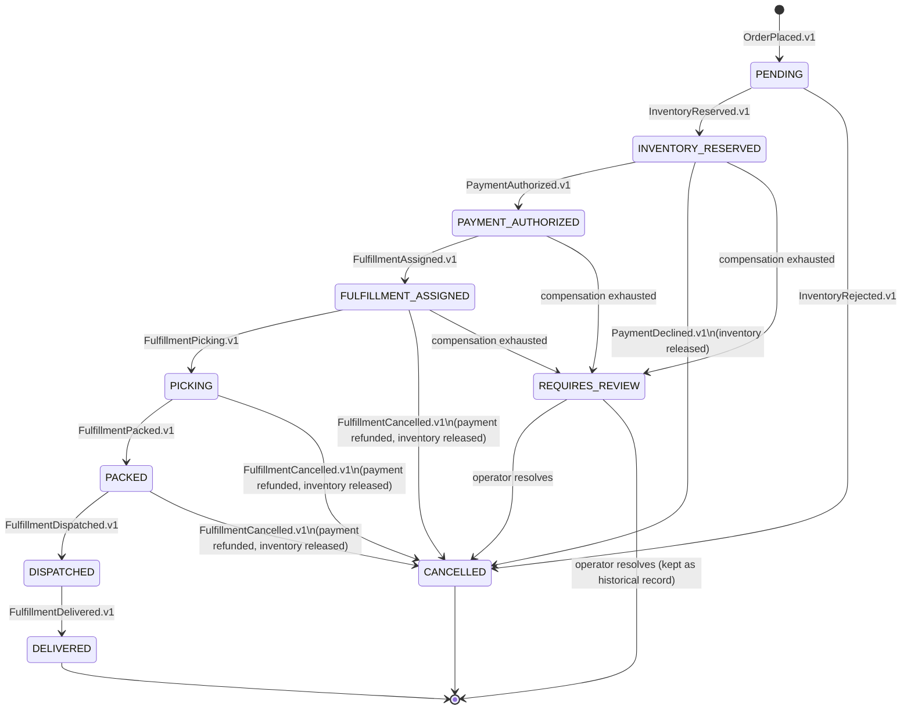
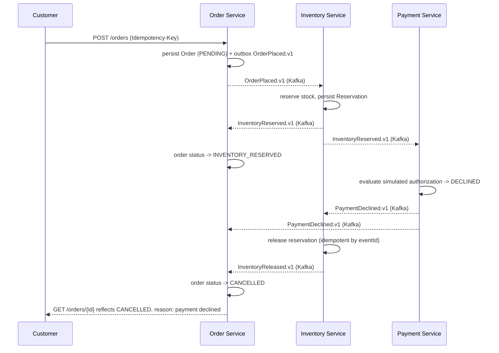

# Domain Model

> Status: design only. No entity, event, or service in this document is implemented yet — see [`PHASE_STATUS.md`](PHASE_STATUS.md).

## Service ownership

| Service | Owns | Does not own |
|---|---|---|
| Order Service | `Order`, `OrderItem`, idempotency records, the operations projection | stock levels, payment state, warehouse state |
| Inventory Service | `StockItem`, `Reservation` | order data, payment data |
| Payment Service | `PaymentAuthorization` | order data, inventory data |
| Fulfillment Service | `Fulfillment` | order data, payment data, inventory data |

No service reads or writes another service's tables. Every cross-service fact (e.g., "was payment authorized?") is learned by consuming that owner's events, not by querying its database.

## Entities

### Order Service

**`Order`**
- `orderId` (ULID, application-generated)
- `customerId`
- `idempotencyKey`, `idempotencyPayloadFingerprint`
- `correlationId`
- `items: OrderItem[]`
- `totalAmount` (`BigDecimal`), `currency`
- `status` (see state machine below)
- `createdAt`, `updatedAt` (UTC `Instant`)

**`OrderItem`**
- `sku`, `quantity` (integer), `unitPrice` (`BigDecimal`)

**Operations projection** — a read model built from every lifecycle event Order Service consumes (its own, plus Inventory/Payment/Fulfillment events), used by the ops console. Not a separate source of truth; always derivable by replaying events.

### Inventory Service

**`StockItem`**
- `sku`, `availableQuantity` (integer), `reservedQuantity` (integer), `version` (optimistic lock)

**`Reservation`**
- `reservationId` (ULID), `orderId`, `sku`, `quantity`, `status` (`RESERVED`, `RELEASED`)

### Payment Service

**`PaymentAuthorization`**
- `paymentId` (ULID), `orderId`, `amount` (`BigDecimal`), `status` (`AUTHORIZED`, `DECLINED`, `REFUNDED`)

The payment service is a deterministic simulator: it never contacts a real payment network and never stores card data. Decline/success outcomes are derived from a documented, reproducible rule (e.g., a threshold or a designated test amount/customer), not randomness, so tests are stable.

### Fulfillment Service

**`Fulfillment`**
- `fulfillmentId` (ULID), `orderId`, `status` (`ASSIGNED`, `PICKING`, `PACKED`, `DISPATCHED`, `DELIVERED`, `CANCELLED`)

## Order status state machine

Cancellation once a fulfillment reaches `DISPATCHED` is not automated — goods are physically in transit, so that case always routes to `REQUIRES_REVIEW` for a human decision.

## Commands (per service)

| Service | Command | Trigger |
|---|---|---|
| Order | `PlaceOrder` | Customer HTTP request (idempotency key required) |
| Inventory | `ReserveStock` | Consumes `OrderPlaced.v1` |
| Inventory | `ReleaseStock` | Consumes `PaymentDeclined.v1` or `FulfillmentCancelled.v1`, or reconciliation job |
| Payment | `AuthorizePayment` | Consumes `InventoryReserved.v1` |
| Payment | `RefundPayment` | Consumes `FulfillmentCancelled.v1`, or reconciliation job |
| Fulfillment | `AssignFulfillment` | Consumes `PaymentAuthorized.v1` |
| Fulfillment | `AdvanceFulfillment` (`StartPicking`, `MarkPacked`, `MarkDispatched`, `MarkDelivered`) | Operator HTTP request |
| Fulfillment | `CancelFulfillment` | Operator HTTP request, allowed only before `DISPATCHED` |

## Versioned events

All envelopes carry `eventId`, `eventType`, `eventVersion`, `occurredAt`, `correlationId`, `causationId`, `aggregateId`, `producer`, `payload`.

| Event | Producer | Meaning |
|---|---|---|
| `OrderPlaced.v1` | Order | A new order was accepted and persisted as `PENDING`. |
| `InventoryReserved.v1` | Inventory | Stock was reserved for every line item. |
| `InventoryRejected.v1` | Inventory | At least one line item could not be reserved. |
| `InventoryReleased.v1` | Inventory | A prior reservation was released back to available stock. |
| `PaymentAuthorized.v1` | Payment | The simulated payment was authorized. |
| `PaymentDeclined.v1` | Payment | The simulated payment was declined. |
| `PaymentRefunded.v1` | Payment | A prior authorization was refunded. |
| `FulfillmentAssigned.v1` | Fulfillment | A fulfillment record was created for the order. |
| `FulfillmentPicking.v1` / `FulfillmentPacked.v1` / `FulfillmentDispatched.v1` / `FulfillmentDelivered.v1` | Fulfillment | Operator-driven warehouse progress. |
| `FulfillmentCancelled.v1` | Fulfillment | The fulfillment was cancelled before dispatch. |

## Invariants

- Inventory: `reservedQuantity + availableQuantity` never exceeds total stock for a SKU, and `availableQuantity` is never negative, even under concurrent reservation attempts for the same SKU.
- Payment: at most one non-refunded `PaymentAuthorization` exists per order.
- Fulfillment: status only moves forward (`ASSIGNED → PICKING → PACKED → DISPATCHED → DELIVERED`), except for operator-triggered `CANCELLED`, which is only reachable before `DISPATCHED`.
- Order: status transitions follow the state machine above; an idempotency key reused with a different request payload (different fingerprint) is rejected as a conflict, never treated as a duplicate success.
- Every consumer is idempotent by `eventId` — reprocessing the same event (Kafka's at-least-once redelivery) must not double-reserve stock, double-charge, or double-create a fulfillment.

## Failure categories

1. **Validation failure** — malformed or invalid request. Rejected synchronously with an RFC 9457 Problem Details response. No compensation needed; nothing was persisted.
2. **Business rejection** — a valid request that cannot proceed (insufficient stock, declined payment). Expected, handled by the compensation rules below, and reflected in order status.
3. **Transient infrastructure failure** — a timeout or temporary unavailability (database, Kafka broker). Retried automatically via a retry topic with backoff.
4. **Poison message** — a message that fails processing repeatedly and would block its partition. Routed to a dead-letter topic after the retry budget is exhausted; does not silently disappear.
5. **Irrecoverable inconsistency** — compensation itself fails after retries (for example, a refund call keeps failing). The order is marked `REQUIRES_REVIEW` and surfaced in the ops console's exception queue for manual operator action.

## Compensation rules

| Trigger | Compensation |
|---|---|
| `InventoryRejected.v1` | Order Service marks the order `CANCELLED`. Nothing to release; no payment was attempted. |
| `PaymentDeclined.v1` | Inventory Service releases the reservation (`InventoryReleased.v1`). Order Service marks the order `CANCELLED`. |
| Operator `CancelFulfillment` (before `DISPATCHED`) | Fulfillment emits `FulfillmentCancelled.v1`. Payment Service refunds (`PaymentRefunded.v1`). Inventory Service releases the reservation (`InventoryReleased.v1`). Order Service marks the order `CANCELLED`. |
| Cancellation requested at or after `DISPATCHED` | Not automated. Order Service marks the order `REQUIRES_REVIEW`; an operator makes the call (e.g., handle as a return once delivered). |
| A compensation action itself exhausts its retry budget | The triggering event is dead-lettered, and the order is marked `REQUIRES_REVIEW` rather than left in a stale intermediate status. |
| Drift detected between a service's own state and Order Service's projection (e.g., a crashed consumer that never got redelivery) | A reconciliation job compares state periodically, replays the missing action where safe, or flags `REQUIRES_REVIEW` when it cannot safely auto-resolve. |

## Happy-path order lifecycle sequence

## Payment-decline compensation sequence

## Related documents

- [`ARCHITECTURE.md`](ARCHITECTURE.md) — service boundaries, choreography, and the system context diagram.
- [`adr/`](adr/) — the reasoning behind outbox/inbox, at-least-once delivery, and event contract decisions referenced above.
