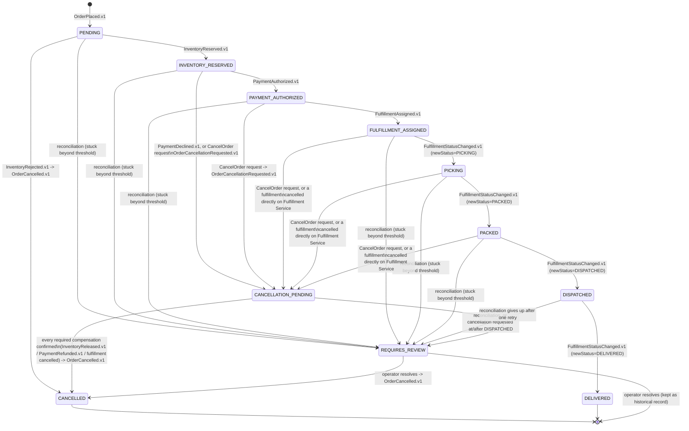
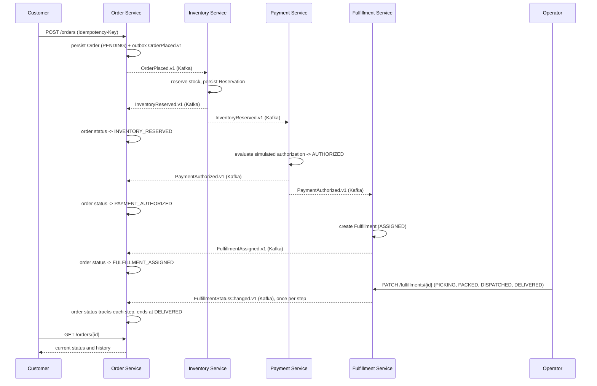
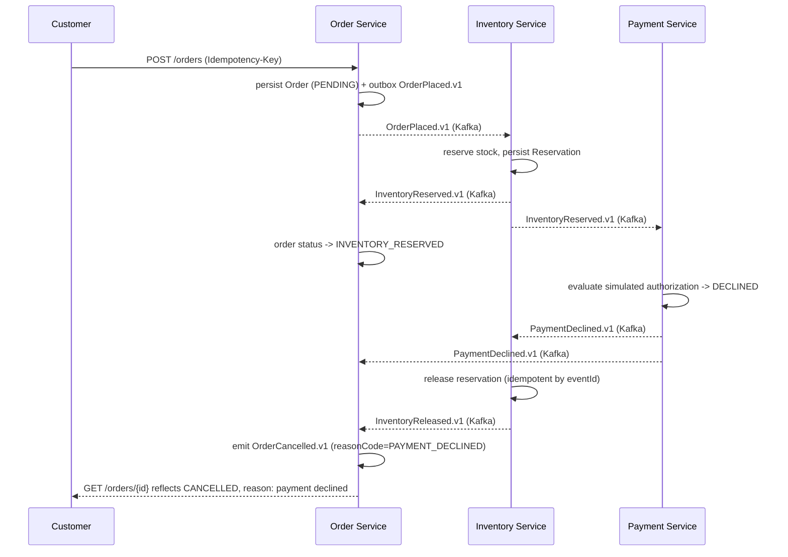

# Domain Model

> Status: the event contracts below are real and enforced — see [`contracts/events/`](../contracts/events/) — and every service has working outbox/inbox messaging infrastructure. All four services now have real entities, command endpoints, and business rules — see [`PHASE_STATUS.md`](PHASE_STATUS.md).

## Service ownership

| Service | Owns | Does not own |
|---|---|---|
| Order Service | `Order`, `OrderItem`, idempotency records, the operations projection | stock levels, payment state, warehouse state |
| Inventory Service | `Product`, `StockItem`, `Reservation` | order data, payment data |
| Payment Service | `Payment`, `PaymentAttempt`, `Refund`, `SimulatorRule`, `OrderPaymentContext` | order data, inventory data |
| Fulfillment Service | `Fulfillment`, `FulfillmentStatusHistory` | order data, payment data, inventory data |

No service reads or writes another service's tables. Every cross-service fact (e.g., "was payment authorized?") is learned by consuming that owner's events, not by querying its database.

## Entities

### Order Service

**`Order`**
- `orderId` (ULID, application-generated)
- `customerId`
- `idempotencyKey`, `idempotencyPayloadFingerprint`
- `correlationId`
- `items: OrderItem[]`
- `totalAmount` (`BigDecimal`), `currency`
- `status` (see state machine below)
- `createdAt`, `updatedAt` (UTC `Instant`)

**`OrderItem`**
- `sku`, `quantity` (integer), `unitPrice` (`BigDecimal`)

**Operations projection** (Phase 9, real as of this document) — a denormalized read model built
from every lifecycle event Order Service consumes (its own, plus Inventory/Payment/Fulfillment
events), backing `/api/v1/ops/**`. Not a separate source of truth: `OrderOperationsProjection` (one
row per order — status, stage timing, every reason code an operator filters by) and
`OrderStageDuration` (one row per stage an order has ever entered, closed duration once it exits)
are always rebuildable from this service's own durable tables (`orders`, `order_status_history`,
`order_cancellation`, `operations_incident`) — see
`OperationsProjectionRebuildService` and `docs/KPI_DICTIONARY.md`'s caching/rebuild notes, not
literal Kafka replay (retention here is finite and there's no replay tooling in this codebase; every
event this service has ever processed already left a durable row before it advanced past it, which
is what rebuild actually replays). `LowStockSignal` is a related but separate latest-state cache (one
row per SKU, from `InventoryLowStock.v1`), explicitly excluded from rebuild since it isn't
order-scoped history. `OperationsIncident` (Phase 8, extended in Phase 9 with an
OPEN→ACKNOWLEDGED→RESOLVED lifecycle) and the new append-only `IncidentActionHistory` back the
incident queue — see `docs/runbooks/INCIDENT_MANAGEMENT.md`. `ProjectionRebuildRun` records
rebuild-run metadata (started/completed, triggered by, orders processed).

### Inventory Service

**`Product`** — a fictional catalog entry: `productId` (UUID), `sku` (unique), `name`, `description`.

**`StockItem`** (implemented as `StockLevel`)
- `sku`, `availableQuantity` (integer), `reservedQuantity` (integer), `version` (optimistic lock — see [`PHASE_STATUS.md`](PHASE_STATUS.md)'s Phase 5 section for the concurrency strategy this enables)

**`Reservation`** (implemented as `InventoryReservation`) — one row per order, not per SKU, so a
multi-item order's reservation is a single aggregate that succeeds or fails atomically as a whole:
- `reservationId` (UUID, application-generated — corrected from this doc's earlier "ULID," which
  no service in this codebase actually uses; every ID here follows `Order.orderId`'s established
  `UUID.randomUUID()` convention), `orderId` (unique), `status` (`RESERVED`, `RELEASED`), `version`
  (optimistic lock)
- `items: ReservationItem[]` — `sku`, `quantity` per line item of the reservation

**`InventoryAdjustment`** — an append-only audit row for every stock mutation, whichever of the
three caused it (`source`: `ADMIN_ADJUSTMENT`, `RESERVATION`, `RELEASE`): `sku`, `changeQuantity`,
`quantityBefore`, `quantityAfter`, `reasonCode`, `reasonDetail`, `actor`, `correlationId`,
`createdAt`.

### Payment Service

**`Payment`** (implemented as `Payment`, corrected from this doc's earlier "ULID" — every ID in
this codebase follows `Order.orderId`'s established `UUID.randomUUID()` convention, same
correction Phase 5 made for `InventoryReservation.reservationId`)
- `paymentId` (UUID), `orderId` (unique), `customerId`, `amount` (`BigDecimal`), `currencyCode`,
  `status` (`AUTHORIZED`, `DECLINED`, `REFUNDED`), `declineReasonCode`/`declineReasonDetail`
  (set only when `DECLINED`), `version` (optimistic lock)

**`PaymentAttempt`** — an append-only audit row per attempt against the (simulated) provider for an
order, including attempts that never produce a `Payment` row because every one of them failed:
`orderId`, `attemptNumber`, `outcome` (`APPROVED`, `DECLINED`, `TIMEOUT`, `TEMPORARY_ERROR`,
`CIRCUIT_OPEN`), `detail`.

**`Refund`** — at most one per payment (`paymentId` unique): `refundId`, `paymentId`, `amount`,
`currencyCode`, `reasonCode`.

**`SimulatorRule`** — the deterministic, seeded decision table the simulator consults, keyed by
`matchAmount`: `outcome` (`APPROVE`, `DECLINE_INSUFFICIENT_FUNDS`, `DECLINE_CARD_DECLINED`,
`TIMEOUT`, `TEMPORARY_ERROR`), `failingAttempts` (how many attempts fail before a `TIMEOUT`/
`TEMPORARY_ERROR` rule recovers on its own; `0` means it never does).

**`OrderPaymentContext`** — Payment Service's own local projection built from consuming
`OrderPlaced.v1`, holding only what it needs and CLAUDE.md allows: `orderId`, `customerId`,
`amount`, `currencyCode`. Never order line items, never anything card- or PII-shaped.

The payment service is a deterministic simulator: it never contacts a real payment network and never
accepts, logs, or persists a card number, bank detail, or SSN. Decline/timeout/temporary-error
outcomes are derived from `SimulatorRule`, keyed by the order's amount — the same "magic test
amount" convention real card-processor sandboxes use (e.g. Adyen's per-amount test result codes) —
never randomness, so tests and demos are stable. See
[ADR 0010](adr/0010-payment-simulator-resilience.md) for why the retry/circuit-breaker wrapper
around the provider call uses Resilience4j's framework-agnostic core libraries rather than its
Spring Boot starter.

### Fulfillment Service

**`Fulfillment`** (`fulfillmentId` is a UUID, corrected from this doc's earlier "ULID" — the same
correction Phase 5 and Phase 6 made for `InventoryReservation.reservationId` and `Payment.paymentId`)
- `fulfillmentId`, `orderId` (unique), `status` (`ASSIGNED`, `PICKING`, `PACKED`, `DISPATCHED`,
  `DELIVERED`, `CANCELLED`), `warehouseId` (a fictional warehouse code, deterministically assigned
  from a fixed list by order id — no real warehouse-management system), `assigneeId` (the operator
  who claimed it; `null` until claimed), `slaDueAt`, `trackingReference` (fictional, set on
  dispatch), `deliveredAt` (set on delivery), `cancellationReasonCode`/`cancellationReasonDetail`
  (set only when `CANCELLED`), `version` (optimistic lock)

**`FulfillmentStatusHistory`** — append-only: one row per status the fulfillment has ever been in,
with the acting operator (or `system` for the initial auto-assignment) and free-text notes/reason.

## Order status state machine

`CANCELLATION_PENDING` tracks exactly which of {inventory release, payment refund, fulfillment cancellation} a given order actually needs — computed once, from what had already happened for that order at the moment cancellation started — in an `order_cancellation` row (see `OrderCancellationTransaction`), not in the order's own status alone. Cancellation once a fulfillment reaches `DISPATCHED` is not automated — goods are physically in transit, so that case always routes to `REQUIRES_REVIEW` for a human decision. Reconciliation can escalate an order stuck in any nonterminal happy-path status (including `PENDING`, `PICKING`, and `PACKED`) straight to `REQUIRES_REVIEW`, which is why the state machine allows that transition from every one of them, not just the ones a compensation trigger can reach directly.

## Commands (per service)

| Service | Command | Trigger |
|---|---|---|
| Order | `PlaceOrder` | Customer HTTP request (idempotency key required) |
| Order | `RequestCancellation` | CUSTOMER (own order only) or OPERATOR/ADMIN (any order, reason required) HTTP request (`POST /api/v1/orders/{orderId}/cancellation-requests`, idempotency key required); records `CANCELLATION_PENDING` and emits `OrderCancellationRequested.v1` when at least one compensation is needed, or finalizes straight to `CANCELLED` when nothing was ever reserved or charged |
| Inventory | `ReserveStock` | Consumes `OrderPlaced.v1` |
| Inventory | `ReleaseStock` | Consumes `PaymentDeclined.v1` or a fulfillment cancellation (`FulfillmentStatusChanged.v1` with `newStatus=CANCELLED`) |
| Payment | `AuthorizePayment` | Consumes `InventoryReserved.v1`, using order/customer/amount/currency context built by separately consuming `OrderPlaced.v1` (see `OrderPaymentContext` above) |
| Payment | `RefundPayment` | OPERATOR/ADMIN HTTP request (`POST /api/v1/payments/{paymentId}/refunds`, `Idempotency-Key` required), or automatically: consumes `OrderCancellationRequested.v1` or a fulfillment cancellation (`FulfillmentStatusChanged.v1` with `newStatus=CANCELLED`) |
| Fulfillment | `AssignFulfillment` | Consumes `PaymentAuthorized.v1` |
| Fulfillment | `AdvanceFulfillment` (`StartPicking`, `MarkPacked`, `MarkDispatched`, `MarkDelivered`) | Operator HTTP request; each emits `FulfillmentStatusChanged.v1` with the corresponding `newStatus` |
| Fulfillment | `CancelFulfillment` | Operator HTTP request, or consumes `OrderCancellationRequested.v1`; allowed only before `DISPATCHED`; emits `FulfillmentStatusChanged.v1` with `newStatus=CANCELLED` |
| Order (ADMIN) | `ReplayDeadLetter` | ADMIN HTTP request (`POST /api/v1/admin/dead-letters/{eventId}/replay`), republishing a persisted dead-lettered event's exact original bytes back onto its original topic — never a client-supplied payload. The same endpoint exists independently in every service, over that service's own dead-lettered events. |
| Order (OPERATOR/ADMIN) | `AcknowledgeIncident` / `AssignIncident` / `ResolveIncident` | OPERATOR/ADMIN HTTP request (`POST /api/v1/ops/incidents/{incidentId}/acknowledge`\|`assign`\|`resolve`) — see `docs/runbooks/INCIDENT_MANAGEMENT.md` for the lifecycle these enforce. |
| Order (ADMIN) | `RebuildOperationsProjection` | ADMIN HTTP request (`POST /api/v1/admin/operations-projection/rebuild`), recomputing the operations projection from this service's own durable tables — see the Operations projection entity description above. |

## Versioned events

All envelopes carry `eventId`, `eventType`, `eventVersion`, `occurredAt`, `correlationId`, `causationId`, `aggregateId`, `producer`, `payload`. This is now a real, machine-validated contract, not just prose — see [`contracts/events/`](../contracts/events/) for the JSON Schema for the envelope and every event below, with example fixtures. `aggregateId` is the order ID for every event regardless of producer (see `contracts/events/README.md` for why); each service's own internal ID (a reservation, payment, or fulfillment ID) travels in `payload` instead.

| Event | Producer | Meaning |
|---|---|---|
| `OrderPlaced.v1` | Order | A new order was accepted and persisted as `PENDING`. |
| `InventoryReserved.v1` | Inventory | Stock was reserved for every line item. |
| `InventoryRejected.v1` | Inventory | At least one line item could not be reserved. No `Reservation` exists to release later. |
| `InventoryReleased.v1` | Inventory | A prior reservation was released back to available stock. |
| `PaymentAuthorized.v1` | Payment | The simulated payment was authorized. Phase 9 added an optional `precedingTechnicalFailureCount` field (how many `TIMEOUT`/`TEMPORARY_ERROR`/`CIRCUIT_OPEN` attempts happened first), computed from Payment Service's own `payment_attempts` table, so Order Service's operations projection can report a payment technical-failure-rate proxy without Payment Service exposing attempt-level detail — see `docs/KPI_DICTIONARY.md`. |
| `PaymentDeclined.v1` | Payment | The simulated payment was declined — a business rejection, never retried. Same Phase 9 `precedingTechnicalFailureCount` addition as `PaymentAuthorized.v1`. |
| `PaymentRefunded.v1` | Payment | A prior authorization was refunded. |
| `FulfillmentAssigned.v1` | Fulfillment | A fulfillment record was created, status `ASSIGNED`. |
| `FulfillmentStatusChanged.v1` | Fulfillment | The fulfillment moved to a new status (`PICKING`, `PACKED`, `DISPATCHED`, `DELIVERED`, or `CANCELLED`) — one generic event instead of one type per status; consumers switch on `payload.newStatus`. Replaces the separate `FulfillmentPicking.v1` / `FulfillmentPacked.v1` / `FulfillmentDispatched.v1` / `FulfillmentDelivered.v1` / `FulfillmentCancelled.v1` events this document originally sketched in Phase 0 — consolidated once the event contracts were actually written in Phase 3. |
| `InventoryLowStock.v1` | Inventory | A SKU's available quantity crossed its configured low-stock threshold, in either direction. SKU-scoped, not order-scoped — its `aggregateId` is a name-based UUID derived from the SKU, the one documented exception to "aggregateId is always the order ID" (see `contracts/events/README.md`). Edge-triggered: emitted once per crossing, not on every mutation while already on one side of the threshold. Added in Phase 9 to back the ops console's low-stock signal. |
| `OrderCancellationRequested.v1` | Order | A cancellation was requested (customer/operator/admin) or reconciliation retried a stuck one; Inventory, Payment, and Fulfillment each independently react by releasing/refunding/cancelling whatever they own for that order, if anything. |
| `OrderCancelled.v1` | Order | Order Service moved an order to `CANCELLED` after every required compensation was confirmed (or immediately, if nothing was ever reserved or charged). |
| `OrderRequiresReview.v1` | Order | Order Service could not safely auto-resolve an order; an operator must act. |

## Invariants

- Inventory: `reservedQuantity + availableQuantity` never exceeds total stock for a SKU, and `availableQuantity` is never negative, even under concurrent reservation attempts for the same SKU.
- Payment: at most one non-refunded `Payment` exists per order (`payments.order_id` is unique), and at most one `Refund` exists per `Payment` (`refunds.payment_id` is unique).
- Fulfillment: status only moves forward (`ASSIGNED → PICKING → PACKED → DISPATCHED → DELIVERED`), except for operator-triggered `CANCELLED`, which is only reachable before `DISPATCHED`.
- Order: status transitions follow the state machine above; an idempotency key reused with a different request payload (different fingerprint) is rejected as a conflict, never treated as a duplicate success.
- Every consumer is idempotent by `eventId` — reprocessing the same event (Kafka's at-least-once redelivery) must not double-reserve stock, double-charge, or double-create a fulfillment.
- Cancellation: an order reaches `CANCELLED` only once every compensation its `order_cancellation` row actually requires has been confirmed — never on a partial set, and never twice (confirming an already-confirmed compensation, or finalizing an already-resolved tracker, is a no-op).
- Incidents: at most one `OPEN` incident of a given kind exists per order at once (a partial unique index backs this, not just an application-level check), so reconciliation and direct triggers (e.g. `CANCELLATION_AFTER_DISPATCH`) never pile up duplicate incidents for the same underlying problem.

## Failure categories

1. **Validation failure** — malformed or invalid request. Rejected synchronously with an RFC 9457 Problem Details response. No compensation needed; nothing was persisted.
2. **Business rejection** — a valid request that cannot proceed (insufficient stock, declined payment). Expected, handled by the compensation rules below, and reflected in order status.
3. **Transient infrastructure failure** — a timeout or temporary unavailability (database, Kafka broker). Retried automatically via a retry topic with backoff.
4. **Poison message** — a message that fails processing repeatedly and would block its partition. Routed to a dead-letter topic after the retry budget is exhausted; does not silently disappear.
5. **Irrecoverable inconsistency** — compensation itself fails after retries (for example, a refund call keeps failing). The order is marked `REQUIRES_REVIEW` and surfaced in the ops console's exception queue for manual operator action.

## Compensation rules

| Trigger | Compensation |
|---|---|
| `InventoryRejected.v1` | Order Service emits `OrderCancelled.v1` directly — no `CANCELLATION_PENDING` tracking, since nothing was ever reserved and payment is never invoked. |
| `PaymentDeclined.v1` | Inventory Service releases the reservation (`InventoryReleased.v1`) on its own, independent reaction to the same event. Order Service starts `CANCELLATION_PENDING` (inventory release required, payment refund not required — nothing was ever authorized) and finalizes to `CANCELLED` once `InventoryReleased.v1` confirms it. |
| Customer/operator `RequestCancellation` before `DISPATCHED` | Order Service computes which compensations this order actually needs from its current status, starts `CANCELLATION_PENDING`, and emits `OrderCancellationRequested.v1`. Inventory, Payment, and Fulfillment Service each independently consume it and release/refund/cancel whatever they own, if anything (a no-op wherever there is nothing to compensate). Order Service finalizes to `CANCELLED` once every required confirmation (`InventoryReleased.v1` / `PaymentRefunded.v1` / a fulfillment cancellation) has arrived — in any order, since the three compensations travel on three different topics with no ordering guarantee between them. |
| A fulfillment cancelled directly on Fulfillment Service (operator action, before `DISPATCHED`) | Fulfillment emits `FulfillmentStatusChanged.v1` (`newStatus=CANCELLED`). Inventory and Payment Service react the same way they would to `OrderCancellationRequested.v1`. Order Service starts (or merges into an existing) `CANCELLATION_PENDING` requiring inventory release and payment refund, and finalizes once both are confirmed. |
| Cancellation requested at or after `DISPATCHED` | Not automated. Order Service emits `OrderRequiresReview.v1` synchronously and opens a `CANCELLATION_AFTER_DISPATCH` incident; an operator makes the call (e.g., handle as a return once delivered). |
| A milestone event (e.g. `InventoryReserved.v1`) arrives for an order already in `CANCELLATION_PENDING` | Handled as a newly-discovered requirement, not an error: the required flag for that compensation flips from not-required to required (never the reverse) so the order still waits for it before finalizing. |
| An event fails processing repeatedly | Routed to that service's dead-letter topic via Spring Kafka's `@RetryableTopic` (bounded retries, exponential backoff) and persisted so an ADMIN can find and safely replay it later (`POST /api/v1/admin/dead-letters/{eventId}/replay` — republishes the exact original bytes, audited, no client-supplied payload). |
| An order makes no progress for longer than its configured threshold, or a cancellation stays unresolved past its own (shorter) threshold | Order Service's reconciliation scheduler (a single fixed-interval job, guarded by a Postgres advisory lock so only one running instance ever acts on a given pass) finds it, deduplicates an incident by kind, and either retries once safely (a verbatim re-publish of `OrderCancellationRequested.v1` — safe because every consumer of it checks its own state first) or, if already retried, escalates straight to `REQUIRES_REVIEW` with a `COMPENSATION_EXHAUSTED` incident. |

## Happy-path order lifecycle sequence

## Payment-decline compensation sequence

## Related documents

- [`ARCHITECTURE.md`](ARCHITECTURE.md) — service boundaries, choreography, the system context diagram, and (as of Phase 3) the Kafka topic/partitioning/retry conventions every service actually runs.
- [`adr/`](adr/) — the reasoning behind outbox/inbox, at-least-once delivery, and event contract decisions referenced above.
- [`contracts/events/README.md`](../contracts/events/README.md) — the authoritative, machine-validated wire format for every event named on this page.
- [`KPI_DICTIONARY.md`](KPI_DICTIONARY.md) — exact formulas for every number the operations API returns.
- [`runbooks/INCIDENT_MANAGEMENT.md`](runbooks/INCIDENT_MANAGEMENT.md) — the incident lifecycle and what to do for each kind.
